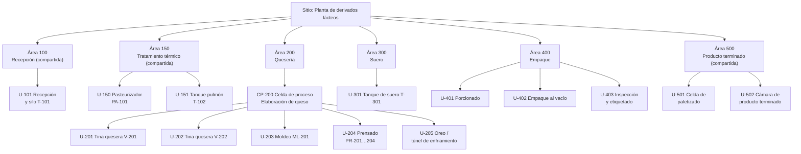
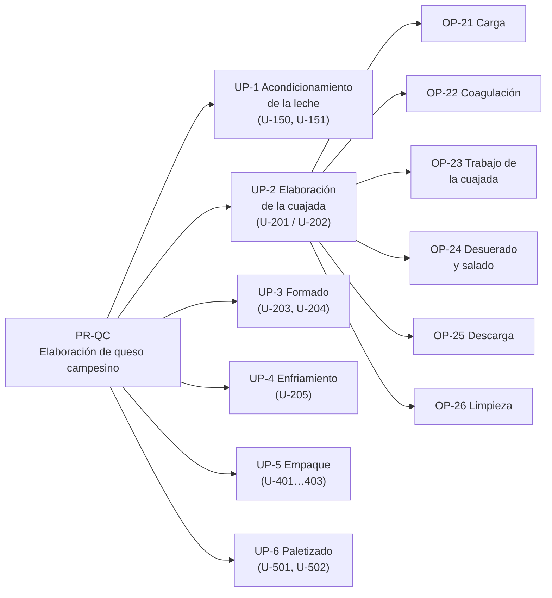

# Modelos ISA-88 — Línea 2: Queso Campesino

> **Alcance:** modelo físico, modelo procedimental y recetas de la línea de queso campesino, según ANSI/ISA-88.01 (IEC 61512-1). Cubre la celda de proceso de quesería y las unidades compartidas de recepción y tratamiento térmico que la alimentan.

> **Documentos relacionados:** `Proceso_Queso_Campesino.md`, `Receta_y_Parametros_Queso.md` y `PID_Queso.md`.

---

## 1. Modelo físico

| Nivel ISA-88 | Elemento |
|---|---|
| Empresa | Empresa de derivados lácteos (cliente) |
| Sitio | Planta de derivados lácteos |
| Área | Área 100 Recepción · Área 150 Tratamiento térmico · **Área 200 Quesería** · Área 300 Suero · Área 400 Empaque · Área 500 Producto terminado |
| Celda de proceso | **CP-200 Elaboración de queso campesino** |
| Unidad | Ver tabla 1.1 |
| Módulo de equipo | Ver tabla 1.2 |
| Módulo de control | Lazos e instrumentos del P&ID (`PID_Queso.md`) |

### 1.1 Unidades

| Unidad | Equipo principal | Capacidad | Tipo de operación |
|---|---|---|---|
| U-101 | Recepción, enfriador E-101 y silo T-101 | 25.000 L | Continua (compartida) |
| U-150 | Pasteurizador HTST PA-101 con tubo de retención HT-101 | 10.000 L/h | Continua (compartida) |
| U-151 | Tanque pulmón T-102 | 10.000 L | Almacenamiento intermedio |
| **U-201 / U-202** | **Tinas queseras V-201 y V-202** | **5.000 L por lote** | **Batch** |
| U-203 | Moldeadora multicabezal ML-201 | 667 kg en 15 min | Discreta |
| U-204 | Prensas neumáticas PR-201…204 | 800 kg por ciclo | Batch |
| U-205 | Túnel de enfriamiento / cuarto de oreo | 4 lotes | Continua |
| U-301 | Tanque de suero T-301 | 10.000 L | Almacenamiento |
| U-401 | Porcionadora | 50 cortes/min | Discreta |
| U-402 | Termoformadora, empacadora con túnel de termoencogido y empacadora de cámara | 28, 20 y 6 und/min | Discreta |
| U-403 | Detector de metales, checkweigher, balanza etiquetadora y codificadora | 100 und/min | Discreta |
| U-501 | Encajonadora y robot paletizador | 10 cajas/min | Discreta (compartida) |
| U-502 | Cámara de producto terminado | 2–6 °C | Almacenamiento (compartida) |

### 1.2 Módulos de equipo y de control de la unidad U-201 (tina quesera)

| Módulo de equipo | Función | Módulos de control |
|---|---|---|
| EM-201 Llenado | Carga la leche pasteurizada desde T-102 | P-201, FQ-201, LT-201, válvula de entrada |
| EM-202 Dosificación de CaCl₂ | Dosifica el cloruro de calcio | P-204, FQ-204 |
| EM-203 Dosificación de cuajo | Dosifica el cuajo | P-205, FQ-205 |
| EM-204 Control térmico | Mantiene la temperatura de la tina | TT-201, TIC-201, TV-201 |
| EM-205 Agitación y corte | Mueve las liras según la fase | M-201, SIC-201 (VFD) |
| EM-206 Desuerado | Retira el suero hacia T-301 | XV-202, P-202, LT-201, LT-301 |
| EM-207 Descarga de cuajada | Envía la cuajada a la moldeadora | XV-203, P-203 |
| EM-208 Limpieza CIP | Limpia la tina entre lotes | Válvulas CIP, conductividad, temperatura |

---

## 2. Modelo procedimental

| Nivel ISA-88 | Elemento |
|---|---|
| Procedimiento | **PR-QC Elaboración de queso campesino** |
| Procedimiento de unidad | UP-1 Acondicionamiento de la leche · UP-2 Elaboración de la cuajada · UP-3 Formado · UP-4 Enfriamiento · UP-5 Empaque · UP-6 Paletizado |
| Operación | Ver tabla 2.1 |
| Fase | Ver tabla 2.1 |

### 2.1 Operaciones y fases

| Procedimiento de unidad | Operación | Fase | Parámetros de la fase | Condición de fin |
|---|---|---|---|---|
| UP-1 Acondicionamiento | OP-11 Estandarizar | PH-111 Ajustar grasa | Grasa 3,0 % | AT-101 en ± 0,1 % |
| | OP-12 Pasteurizar | PH-121 Calentar y retener | 73 °C, 15–20 s | TT-103 ≥ 72 °C (si no, desvío por XV-101) |
| | | PH-122 Enfriar | 33 °C | TT-104 en 32–35 °C |
| UP-2 Elaboración de la cuajada | OP-21 Carga | PH-211 Llenar tina | 5.000 L | FQ-201 = volumen de receta |
| | | PH-212 Dosificar CaCl₂ | 20 g/100 L | FQ-204 = dosis |
| | | PH-213 Premadurar | 33 °C, 8–10 rpm | 15 min |
| | OP-22 Coagulación | PH-221 Dosificar cuajo | 25 IMCU/L | FQ-205 = dosis |
| | | PH-222 Mezclar | 10–12 rpm | 2–3 min |
| | | PH-223 Reposar | Liras detenidas, 33 °C | 35 min y punto de corte confirmado |
| | OP-23 Trabajo de la cuajada | PH-231 Cortar | 3–5 rpm, grano de 2 cm | 8 min |
| | | PH-232 Agitar | Rampa de 6 a 12 rpm, 33–35 °C | 20 min |
| | OP-24 Desuerado y salado | PH-241 Desuerar | 60 % del suero | LT-201 en el nivel objetivo |
| | | PH-242 Salar | 1,8 % sobre el peso del queso | 12 min |
| | OP-25 Descarga | PH-251 Enviar cuajada a moldeo | Caudal de P-203 | LT-201 en vacío |
| | OP-26 Limpieza | PH-261 CIP | Soda 1–2 % a 75 °C, ácido 0,5–1 % a 65 °C | Conductividad y tiempo conformes |
| UP-3 Formado | OP-31 Moldear | PH-311 Dosificar en moldes | **1,0 kg o 3,0 kg según la receta** | Número de moldes del lote |
| | OP-32 Prensar | PH-321 Prensar | **1,5–3 bar; 75, 60 o 90 min según la receta** | Tiempo cumplido |
| | | PH-322 Voltear | **1 o 2 volteos según la receta** | Volteos cumplidos |
| | OP-33 Desmoldar | PH-331 Desmoldar y enviar a enfriamiento | — | Moldes vacíos |
| UP-4 Enfriamiento | OP-41 Enfriar | PH-411 Orear | **4–6 °C; tiempo según la receta** | Temperatura interna ≤ 6 °C |
| UP-5 Empaque | OP-51 Porcionar | PH-511 Cortar en cuñas | **Solo QC-250: 12 cuñas por bloque** | Bloques del lote |
| | OP-52 Empacar | PH-521 Empacar al vacío | **Equipo y temperatura de sellado según la receta** | Unidades del lote |
| | OP-53 Inspeccionar | PH-531 Detectar metales y pesar | **Peso fijo o variable según la receta** | Unidades conformes |
| | OP-54 Codificar | PH-541 Imprimir lote y fechas | Lote, fabricación y vencimiento | Unidades del lote |
| UP-6 Paletizado | OP-61 Encajonar | PH-611 Armar cajas | **24, 12 o 4 und/caja** | Cajas del lote |
| | OP-62 Paletizar | PH-621 Paletizar con robot | **Patrón de estiba según la receta** | Estibas del lote |

### 2.2 Estados de las fases

Las fases siguen el modelo de estados ISA-88: `IDLE → RUNNING → COMPLETE`, con los estados `HOLDING / HELD / RESTARTING` para pausas del operador, `STOPPING / STOPPED` para paradas controladas y `ABORTING / ABORTED` para paradas de emergencia. El estado de cada lote y de cada fase se muestra en el SCADA.

---

## 3. Recetas

### 3.1 Tipos de receta

| Tipo | Contenido | Responsable |
|---|---|---|
| Receta general | Define el queso campesino sin referirse a equipos concretos | I+D / calidad (ERP) |
| Receta de sitio | Adapta la receta general a la planta (insumos locales, normativa colombiana) | Ingeniería de planta |
| **Receta maestra** | Una por presentación (RM-QC-250, RM-QC-1K y RM-QC-3K), ligada a las unidades de la celda CP-200 | Ingeniería de procesos (MES) |
| Receta de control | Copia de la receta maestra para un lote concreto, con tamaño de lote y equipos asignados | MES / control batch |

### 3.2 Recetas maestras

Las tres recetas maestras comparten la fórmula y el procedimiento de la tina (UP-1 y UP-2). Se diferencian en los parámetros de UP-3 a UP-6.

| Elemento de la receta | RM-QC-250 | RM-QC-1K | RM-QC-3K |
|---|---|---|---|
| **Encabezado** | | | |
| Producto | Queso campesino cuña 250 g | Queso campesino 1 kg | Queso campesino bloque 3 kg |
| Tamaño de lote | 5.000 L → 666,7 kg | 5.000 L → 666,7 kg | 5.000 L → 666,7 kg |
| **Fórmula (por lote)** | | | |
| Leche estandarizada al 3,0 % | 5.000 L | 5.000 L | 5.000 L |
| CaCl₂ | 1,00 kg | 1,00 kg | 1,00 kg |
| Cuajo de 200 IMCU/mL | 625 mL | 625 mL | 625 mL |
| Sal | 12,0 kg | 12,0 kg | 12,0 kg |
| Empaque primario | 2.664 bandejas termoformadas | 666 bolsas termoencogibles | 222 bolsas de cámara |
| Cajas | 111 | 55 | 55 |
| **Requisitos de equipo** | | | |
| Tina | V-201 o V-202 | V-201 o V-202 | V-201 o V-202 |
| Molde | 3 kg (222 moldes) | 1 kg (666 moldes) | 3 kg (222 moldes) |
| Porcionadora | Requerida | No | No |
| Empacadora | Termoformadora | Termoencogible | De cámara |
| Etiquetado | Peso fijo | Peso fijo | Balanza etiquetadora (peso variable) |
| **Parámetros de procedimiento** | | | |
| PH-311 Peso por molde | 3,0 kg | 1,0 kg | 3,0 kg |
| PH-321 Tiempo de prensado | 75 min | 60 min | 90 min |
| PH-322 Volteos | 1 | 1 | 2 |
| PH-411 Tiempo de oreo (cuarto frío / túnel) | 10 h / 2,5 h | 8 h / 2 h | 12 h / 3 h |
| PH-511 Porcionado | 12 cuñas por bloque | — | — |
| PH-521 Temperatura de sellado | 140 °C | 150 °C + túnel a 85–90 °C | 140 °C |
| PH-531 Control de peso | 250 g ± tolerancia legal | 1.000 g ± tolerancia legal | Peso real impreso |
| PH-611 Unidades por caja | 24 | 12 | 4 |
| PH-621 Patrón de estiba | Patrón A | Patrón B | Patrón C |
| Vida útil | 18 días | 20 días | 20 días |

### 3.3 Receta de control y trazabilidad del lote

Cuando el MES libera una orden de producción, crea una receta de control con:

- Identificador de lote: `QC-AAAAMMDD-NN` (por ejemplo, `QC-20261012-03`).
- Receta maestra y versión.
- Tina asignada (V-201 o V-202) y lote de leche pasteurizada de origen.
- Lotes de insumos (CaCl₂, cuajo, sal y empaque).
- Valores reales registrados por fase: volúmenes dosificados, temperaturas, tiempos, curva de pasteurización (PCC), peso por molde, unidades producidas y rechazadas.

El registro del lote (*batch record*) queda en el historiador y se envía al MES al cerrar cada procedimiento de unidad.

---

## 4. Relación entre los modelos

| Modelo procedimental | Modelo físico | Control |
|---|---|---|
| Procedimiento PR-QC | Celda de proceso CP-200 | Control de coordinación (MES / gestor batch) |
| Procedimiento de unidad UP-2 | Unidad U-201 o U-202 | Control de unidad (PLC) |
| Operación OP-22 Coagulación | Unidad U-201 | Secuencia en Grafcet |
| Fase PH-221 Dosificar cuajo | Módulo de equipo EM-203 | Lógica de fase (Ladder) |
| — | Módulo de control P-205 / FQ-205 | Control básico |

---

## 5. Referencias

- ANSI/ISA-88.00.01-2010, *Batch Control Part 1: Models and Terminology* (IEC 61512-1).
- Material del curso APM 2026-2: *Diapositivas ISA-95 / ISA-88*.
- Tetra Pak, *Dairy Processing Handbook*, cap. 14 (Cheese).
