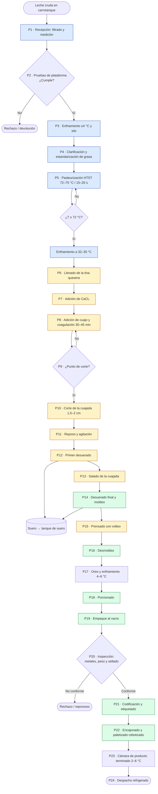
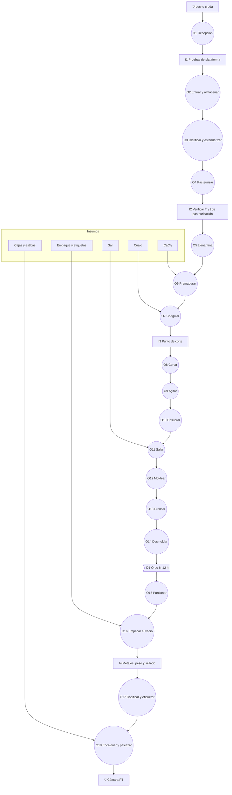
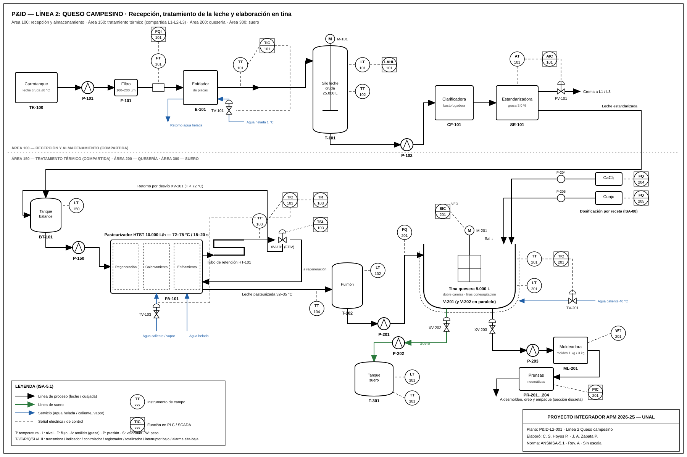

# Línea 2 – Quesos: Proceso de Producción del Queso Campesino

**Proyecto Integrador APM 2026-2S** · Automatización de Procesos de Manufactura – UNAL
**Responsables línea 2:** Cristian S. Hoyos P. · José Andrés Zapata P.
**Alcance:** elaboración de queso fresco: materia prima e insumos, maquinaria, secuencia de operaciones y flujo del proceso, desde la recepción de la leche hasta el despacho.

> Los parámetros de proceso provienen de la búsqueda y el análisis del sector lácteo (literatura técnica e industria colombiana) y constituyen la propuesta inicial de ingeniería. Se contrastarán con la visita técnica a Alpina Sopó (27 y 28 de octubre de 2026).

---

## 1. Descripción del producto

| Atributo | Descripción |
|---|---|
| Producto | Queso campesino: queso fresco de pasta blanda, **no madurado**, prensado y salado, de leche de vaca entera pasteurizada |
| Clasificación (NTC 750) | Queso fresco, semiduro, graso |
| Humedad | 46 – 55 % |
| Grasa en extracto seco | ≥ 40 % |
| Sal | 1,6 – 2,0 % |
| pH final | 6,2 – 6,6 |
| Rendimiento | ≈ 7,5 L de leche por kg de queso (≈ 13 %) |
| Presentaciones | 250 g, 1 kg y bloque de 3 kg (presentaciones comerciales del Queso Campesino Alpina). Ver §1.1 |
| Empaque | Bolsa plástica coextruida (PA/PE) al vacío o termoencogible |
| Conservación | Refrigerado a 2 – 6 °C |
| Vida útil | 18 – 20 días (en cadena de frío) |

**Marco normativo de referencia (Colombia):** Decreto 616 de 2006 (requisitos de la leche), NTC 750 (quesos), Resolución 2310 de 1986 (derivados lácteos), Resolución 2674 de 2013 (BPM) y Resolución 5109 de 2005 (rotulado).

### 1.1 Tres presentaciones de queso campesino

La línea elabora un solo producto, queso campesino, con una única receta en la tina. Las tres referencias corresponden a las presentaciones comerciales del Queso Campesino Alpina y se diferencian en formato de molde, prensado, oreo, porcionado, empaque, etiquetado, encajonado y paletizado.

| | **QC-250 – Queso campesino 250 g** | **QC-1K – Queso campesino 1 kg** | **QC-3K – Queso campesino bloque 3 kg** |
|---|---|---|---|
| Canal | Retail (supermercados, tiendas) | Retail familiar | Institucional / HORECA (venta B2B) |
| Formato | Cuña de 250 g porcionada de un bloque de 3 kg | Bloque de 1 kg moldeado individualmente | Bloque entero de 3 kg, peso variable |
| Moldeo | Molde de 3 kg | Molde de 1 kg | Molde de 3 kg |
| Prensado | 75 min, 1 volteo | 60 min, 1 volteo | 90 min, 2 volteos |
| Oreo | 10 h | 8 h | 12 h |
| Porcionado | Sí: 12 cuñas por bloque | No | No |
| Empaque | Termoformado al vacío | Bolsa termoencogible al vacío | Bolsa de vacío de cámara |
| Etiquetado | Peso fijo | Peso fijo | Peso variable (balanza etiquetadora, precio por kg) |
| Inspección | Metales + checkweigher | Metales + checkweigher | Metales + pesaje individual |
| Encajonado | 24 und/caja | 12 und/caja | 4 und/caja |
| Vida útil | 18 días (superficie de corte expuesta) | 20 días | 20 días |

**Receta común de la tina:** leche con 3,0 % de grasa, CaCl₂ 20 g/100 L, cuajo 25 IMCU/L, sal 1,8 % sobre el peso del queso y rendimiento de 7,5 L/kg.

---

## 2. Materia prima e insumos

### 2.1 Materia prima principal: leche cruda de vaca

| Parámetro de aceptación | Valor de referencia |
|---|---|
| Temperatura de recepción | ≤ 4 – 6 °C |
| Densidad a 15 °C | 1,030 – 1,033 g/mL |
| Grasa | ≥ 3,0 % |
| Proteína | ≥ 2,9 % |
| Sólidos totales | ≥ 11,3 % |
| Acidez titulable | 0,13 – 0,17 % (como ácido láctico) |
| Prueba de alcohol (68–72 %) | Negativa (sin coagulación) |
| Residuos de antibióticos | Negativo |
| Adulterantes (agua, neutralizantes) | Ausencia; crioscopia −0,530 a −0,510 °C |

### 2.2 Receta base (lote de 5.000 L de leche)

| Insumo | Función | Dosis de referencia | Cantidad por lote |
|---|---|---|---|
| Leche estandarizada y pasteurizada | Materia prima | – | 5.000 L (≈ 5.160 kg) |
| Cloruro de calcio (CaCl₂) al 33–40 % | Repone el calcio que se pierde al pasteurizar y mejora la coagulación | 20 g/100 L | 1,0 kg |
| Cuajo (quimosina líquida) | Coagula la caseína | 25 IMCU/L | 625 mL (cuajo de 200 IMCU/mL) |
| Sal (NaCl) grado alimenticio | Sabor, desuerado y conservación | 1,8 % sobre el peso del queso | 12,0 kg |
| Sorbato de potasio (opcional) | Conservante (antimohos) | Según límite de la normativa | Según normativa |

**Balance de masa aproximado del lote:**

```
Leche 5.000 L (≈5.160 kg) + sal ≈12 kg + aditivos ≈2 kg
        │
        ├──► Queso campesino ≈ 667 kg  (7,5 L/kg)
        └──► Suero dulce ≈ 4.507 kg  (subproducto)
```

### 2.3 Materiales de empaque

- Bolsas de vacío o termoencogibles, con barrera a gases.
- Etiquetas con lote, fecha de fabricación y de vencimiento (y código de barras / QR para trazabilidad).
- Cajas de cartón corrugado.
- Estibas y película estirable (*stretch film*).

### 2.4 Servicios industriales (compartidos con las líneas 1 y 3)

| Servicio | Uso en la línea de quesos |
|---|---|
| Vapor / agua caliente (caldera) | Pasteurizador, camisa de la tina, CIP |
| Agua helada / banco de hielo (chiller) | Enfriamiento en la recepción y en la salida del pasteurizador |
| Refrigeración (amoníaco o freón) | Cuarto de oreo, cámara de producto terminado |
| Aire comprimido | Prensas neumáticas, válvulas, empacadora |
| Agua potable | Proceso y limpieza |
| Sistema CIP (soda 1–2 %, ácido nítrico 0,5–1 %) | Limpieza de tanques, tuberías, pasteurizador y tinas |
| Energía eléctrica | Motores, bombas, compresores y control |
| Manejo de suero | Tanque de suero refrigerado para su venta o reproceso |

---

## 3. Maquinaria y equipos

| # | Área | Equipo | Función | Instrumentación y actuadores principales |
|---|---|---|---|---|
| E1 | Recepción | Bomba sanitaria centrífuga + filtro de línea | Descarga el carrotanque | Motor con VFD, presostato |
| E2 | Recepción | Desaireador + caudalímetro másico / báscula | Mide la leche recibida | Caudalímetro Coriolis, sensor de nivel |
| E3 | Laboratorio | Analizador de leche (tipo Ekomilk/Milkoscan), kit de antibióticos | Pruebas de plataforma | – (datos hacia el LIMS/MES) |
| E4 | Recepción | Enfriador de placas | Enfría la leche a ≤ 4 °C | PT100 y válvula de agua helada |
| E5 | Almacenamiento | Silos isotérmicos (20.000 – 30.000 L) con agitador | Almacena la leche cruda (compartido) | Nivel radar, PT100, motor del agitador |
| E6 | Tratamiento | Clarificadora / bactofugadora centrífuga | Retira impurezas y esporas | Velocidad, presión, válvulas de descarga |
| E7 | Tratamiento | Descremadora + estandarizadora en línea | Ajusta la grasa (3,0 % o 2,0 %) | Densímetro/analizador en línea, válvula de control |
| E8 | Tratamiento | **Pasteurizador HTST de placas** (5.000 – 10.000 L/h) | 72 – 75 °C durante 15 – 20 s (punto crítico de control) | PT100 dobles, registrador, **válvula de desvío de flujo (FDV)**, bomba de refuerzo |
| E9 | Tratamiento | Tanque pulmón de leche pasteurizada | Almacenamiento intermedio | Nivel, temperatura |
| E10 | Quesería | **Tina quesera de doble camisa** (5.000 L) con liras de corte y agitación | Coagula, corta, agita y desuera | PT100, motor de liras con VFD, válvulas de dosificación y de vapor/agua, sensor de nivel |
| E11 | Quesería | Dosificadores (CaCl₂, cuajo) | Adición automática de los aditivos de la receta | Bombas dosificadoras, caudalímetros |
| E12 | Quesería | Tamiz / mesa de desuerado | Separa la cuajada del suero | Válvula de fondo, bomba de suero |
| E13 | Quesería | Moldeadora / dosificadora de cuajada + moldes perforados | Llena los moldes por peso | Celda de carga, cilindros neumáticos |
| E14 | Quesería | **Prensa neumática** (horizontal o vertical) | Prensa los moldes | Regulador de presión, temporizador, electroválvulas |
| E15 | Quesería | Desmoldeadora y lavadora de moldes | Saca el queso y lava los moldes | Sensores de presencia, bombas |
| E16 | Frío | Cuarto de oreo / enfriamiento (4 – 6 °C) | Enfría y reafirma el queso | Temperatura y humedad relativa |
| E17 | Empaque | Porcionadora (bloque de 3 kg → cuñas de 250 g) | Corta en porciones | Servomotor, sensor de peso |
| E18 | Empaque | **Empacadora al vacío** (termoformadora o de cámara) + túnel de termoencogido | Empaca el producto | Vacuómetro, temperatura de sellado |
| E19 | Inspección | Detector de metales + **checkweigher** (control de peso) | Control de calidad en línea | Celda de carga, rechazo neumático |
| E20 | Empaque | Codificadora / etiquetadora (inkjet o láser) | Imprime lote y fecha | Lector de código de barras / visión |
| E21 | Empaque | Encajonadora + **celda robotizada de paletizado** | Arma cajas y estibas | Robot, sensores de presencia, barreras de seguridad |
| E22 | Almacenamiento | Cámara de producto terminado (2 – 6 °C) | Almacena hasta el despacho | Temperatura y registro continuo |
| E23 | Servicios | Tanque de suero refrigerado | Almacena el subproducto | Nivel, temperatura |
| E24 | Servicios | Sistema CIP | Limpieza automática entre lotes | Conductividad, temperatura, caudal |

---

## 4. Secuencia del proceso: qué va primero

| Paso | Operación | Parámetros de referencia | Tiempo (lote de 5.000 L) | Tipo de operación | Equipo |
|---|---|---|---|---|---|
| 1 | **Recepción de la leche** (descarga, filtrado y medición) | ≤ 6 °C; filtro de 100–200 µm | 30 – 40 min por carrotanque | Continua | E1, E2 |
| 2 | **Pruebas de plataforma** (calidad) | Alcohol, acidez, densidad, grasa, antibióticos | 15 – 20 min (en paralelo con la descarga) | Inspección | E3 |
| 3 | **Enfriamiento y almacenamiento** en silo | ≤ 4 °C, máximo 24 – 48 h, agitación periódica | Variable (inventario) | Continua / almacenamiento | E4, E5 |
| 4 | **Clarificación y estandarización** | Grasa al 3,0 % | ≈ 30 min (en línea con el paso 5) | Continua | E6, E7 |
| 5 | **Pasteurización HTST** | **72 – 75 °C durante 15 – 20 s** y enfriamiento a 32 – 35 °C | ≈ 30 – 60 min (según el caudal) | Continua (punto crítico de control) | E8 |
| 6 | **Llenado de la tina** | 5.000 L a 32 – 35 °C | Incluido en el paso 5 | Batch | E10 |
| 7 | **Adición de CaCl₂** y premaduración | 20 g/100 L; 15 min con agitación suave | 15 – 20 min | Batch | E10, E11 |
| 8 | **Adición de cuajo y coagulación** | 32 – 35 °C; agitar 2 – 3 min y dejar en reposo | 30 – 45 min | Batch | E10, E11 |
| 9 | **Verificación del punto de corte** | Corte limpio, suero verdoso y translúcido | 2 – 5 min | Inspección | E10 |
| 10 | **Corte de la cuajada** | Cubos de 1,5 – 2 cm con liras | 5 – 10 min | Batch | E10 |
| 11 | **Reposo y agitación** | 32 – 36 °C; agitación lenta que va subiendo de velocidad | 15 – 25 min | Batch | E10 |
| 12 | **Primer desuerado** | Se retira el 50 – 70 % del suero | 10 – 15 min | Batch | E10, E12, E23 |
| 13 | **Salado de la cuajada** (en la tina) | 1,5 – 2,0 % de sal sobre el peso esperado; mezclar | 10 – 15 min | Batch | E10 |
| 14 | **Desuerado final y moldeo** | Llenado por peso en moldes de 1 kg o 3 kg | 20 – 30 min | Discreta | E12, E13 |
| 15 | **Prensado** con volteo | Presión baja/media; volteo a los 15 – 20 min | 30 – 90 min | Batch / discreta | E14 |
| 16 | **Desmoldeo** | – | 10 – 20 min | Discreta | E15 |
| 17 | **Oreo y enfriamiento** | 4 – 6 °C; HR 85 – 90 % | 6 – 12 h (hasta el día siguiente) | Demora / almacenamiento | E16 |
| 18 | **Porcionado** (solo QC-250) | Bloque de 3 kg en 12 cuñas de 250 g; tolerancia ± 2 % | Según el volumen | Discreta | E17 |
| 19 | **Empaque al vacío** y termoencogido | Vacío ≥ 95 %; sellado 130 – 160 °C | ≈ 20 – 30 unidades/min | Discreta | E18 |
| 20 | **Inspección en línea** | Detector de metales, control de peso y de sellado | En línea | Inspección | E19 |
| 21 | **Codificación y etiquetado** | Lote, fecha de fabricación, vencimiento y código | En línea | Discreta | E20 |
| 22 | **Encajonado y paletizado** | 24, 12 o 4 und/caja según la presentación | En línea | Discreta (robot) | E21 |
| 23 | **Almacenamiento de producto terminado** | 2 – 6 °C; FEFO | Hasta el despacho | Almacenamiento | E22 |
| 24 | **Despacho** | Vehículo refrigerado a ≤ 6 °C | – | Transporte | – |
| ⟳ | **Limpieza CIP** de la tina, tuberías y pasteurizador | Enjuague → soda 1–2 % a 75 °C → enjuague → ácido 0,5–1 % a 65 °C → enjuague | 45 – 60 min entre lotes | Batch (servicio) | E24 |

**Tiempo de un lote en la tina (pasos 6 a 13):** ≈ 1,7 – 2,5 h.
**MLT aproximado, de leche pasteurizada a queso empacado:** ≈ 10 – 16 h, donde el oreo (paso 17) es la demora dominante.

---

## 5. Diagrama de flujo del proceso



*Colores: azul = operación continua · amarillo = operación batch · verde = operación discreta.*

---

## 6. Diagrama de operaciones de proceso (DOP)

Simbología: ○ operación, □ inspección, ⇨ transporte, D demora, ▽ almacenamiento, ⊡ actividad combinada. Las entradas laterales corresponden a los insumos que ingresan en cada operación.



**Resumen del DOP:** 18 operaciones · 4 inspecciones · 1 demora principal (oreo) · 2 almacenamientos.

---

## 7. Cursograma analítico (flow process chart)

| N.º | Actividad | ○ | ⇨ | D | □ | ▽ | Tiempo (min) | Observación / oportunidad de automatización |
|---|---|:-:|:-:|:-:|:-:|:-:|---:|---|
| 1 | Descarga del carrotanque | ● | | | | | 35 | Caudalímetro másico con registro automático en el MES |
| 2 | Pruebas de plataforma | | | | ● | | 20 | Resultados de laboratorio enviados al MES (trazabilidad del proveedor) |
| 3 | Bombeo a silo y enfriamiento | | ● | | | | 30 | – |
| 4 | Almacenamiento en silo | | | | | ● | 240 – 1.440 | Control de inventario y de temperatura por SCADA |
| 5 | Clarificar, estandarizar y pasteurizar | ● | | | | | 45 | Lazo PID de temperatura y FDV automática |
| 6 | Llenado de la tina | | ● | | | | incl. | Control de nivel y dosificación por receta (ISA-88) |
| 7 | Premaduración con CaCl₂ | ● | | | | | 15 | Dosificación automática |
| 8 | Coagulación | ● | | | | | 40 | Sensor óptico de coagulación (reemplaza la prueba manual) |
| 9 | Verificación del punto de corte | | | | ● | | 5 | **Hoy es manual**; se puede automatizar |
| 10 | Corte y agitación | ● | | | | | 30 | Secuencia de liras con VFD |
| 11 | Desuerado y salado | ● | | | | | 25 | Bomba y válvulas automáticas, dosificación de sal |
| 12 | Moldeo | ● | | | | | 25 | Moldeadora por peso |
| 13 | Espera por prensa disponible | | | ● | | | 10 – 20 | **Posible cuello de botella** |
| 14 | Prensado y volteo | ● | | | | | 60 | Prensa neumática temporizada |
| 15 | Desmoldeo y traslado a oreo | | ● | | | | 15 | Transportador |
| 16 | Oreo / enfriamiento | | | ● | | | 360 – 720 | **Mayor tiempo no productivo** del proceso |
| 17 | Traslado a empaque | | ● | | | | 10 | – |
| 18 | Empaque al vacío | ● | | | | | 30 | – |
| 19 | Detector de metales y control de peso | | | | ● | | en línea | Rechazo automático |
| 20 | Codificación, encajonado y paletizado | ● | | | | | 20 | **Celda robotizada** |
| 21 | Almacenamiento de producto terminado | | | | | ● | hasta el despacho | WMS / FEFO |
| | **Total de actividades** | **11** | **4** | **2** | **3** | **2** | | |

---

## 8. EDT de producción (desglose del proceso por etapas)

```
Producción de Queso Fresco (Línea 2)
├── 1. Recepción y almacenamiento de la leche  [recurso compartido L1-L2-L3]
│   ├── 1.1 Descarga, filtrado y medición
│   ├── 1.2 Pruebas de calidad de plataforma
│   └── 1.3 Enfriamiento y almacenamiento en silo
├── 2. Tratamiento de la leche  [recurso compartido]
│   ├── 2.1 Clarificación / bactofugación
│   ├── 2.2 Estandarización de grasa
│   └── 2.3 Pasteurización HTST y enfriamiento
├── 3. Elaboración del queso (tina quesera)  [exclusivo L2]
│   ├── 3.1 Llenado y premaduración (CaCl₂)
│   ├── 3.2 Coagulación con cuajo
│   ├── 3.3 Corte y agitación
│   ├── 3.4 Desuerado
│   └── 3.5 Salado
├── 4. Formado del queso  [exclusivo L2]
│   ├── 4.1 Moldeo
│   ├── 4.2 Prensado y volteo
│   ├── 4.3 Desmoldeo
│   └── 4.4 Oreo y enfriamiento
├── 5. Empaque e inspección
│   ├── 5.1 Porcionado
│   ├── 5.2 Empaque al vacío y termoencogido
│   ├── 5.3 Inspección (metales, peso, sellado)
│   └── 5.4 Codificación y etiquetado
├── 6. Paletizado, almacenamiento y despacho
│   ├── 6.1 Encajonado
│   ├── 6.2 Paletizado robotizado
│   ├── 6.3 Almacenamiento refrigerado de producto terminado
│   └── 6.4 Despacho en cadena de frío
└── 7. Procesos de soporte
    ├── 7.1 Limpieza CIP
    ├── 7.2 Manejo de suero (subproducto)
    ├── 7.3 Servicios industriales (vapor, frío, aire, agua)
    └── 7.4 Control de calidad y trazabilidad del lote
```

---

## 9. Variables críticas y puntos de control

| Etapa | Variable crítica | Límite | ¿Por qué es crítica? |
|---|---|---|---|
| Recepción | Temperatura, acidez, antibióticos | ≤ 6 °C; 0,13–0,17 %; negativo | Inocuidad y aptitud para la coagulación |
| Pasteurización | **Temperatura y tiempo de retención** | ≥ 72 °C / ≥ 15 s | **PCC (HACCP):** elimina patógenos como *Listeria* y *Brucella* |
| Coagulación | Temperatura y dosis de cuajo | 32–35 °C | Firmeza del gel, rendimiento y humedad final |
| Corte | Tamaño del grano | 1,5–2 cm | Controla la humedad y el rendimiento |
| Salado | % de sal | 1,5–2,0 % | Sabor, vida útil y cumplimiento de la etiqueta |
| Prensado | Presión y tiempo | Según receta | Forma, textura y humedad |
| Oreo y almacenamiento | Temperatura | 2–6 °C | Vida útil y crecimiento microbiano |
| Empaque | Nivel de vacío, sellado y peso neto | ≥ 95 %; hermético; ± tolerancia legal | Vida útil y metrología legal |

---

## 10. Recursos compartidos con las otras líneas

- **Compartidos:** recepción de leche, silos de leche cruda, clarificadora, estandarizadora, **pasteurizador** (se programa por turnos o campañas entre yogur, kumis y queso), servicios industriales, CIP, cámara de frío, celda de paletizado y despacho.
- **Exclusivos de la línea de quesos:** tinas queseras, moldeadora, prensas, cuarto de oreo, empacadora al vacío y manejo de suero.
- **Cambio de producto en el pasteurizador:** el yogur y el kumis se pasteurizan a ≈ 85–95 °C durante 5–10 min. El queso usa 72–75 °C durante 15–20 s para no desnaturalizar las proteínas del suero y conservar el rendimiento. Cada cambio entre líneas implica ajustar la receta y, a menudo, un enjuague o CIP, que se incluye como tiempo de setup en el VSM y en la simulación.
- **Simulación (Tecnomatix):** el pasteurizador compartido y las prensas son candidatos a cuello de botella. El oreo es la mayor demora del flujo de valor.

---

## 10.1 P&ID de la línea

Plano P&ID-L2-001 (ANSI/ISA-5.1): recepción y almacenamiento de leche, tratamiento térmico compartido, quesería y suero. La lista de equipos, el índice de 34 instrumentos y válvulas y los lazos de control están en [PID_Queso.md](../../../1-transformacion-digital-industrial/diagramas-de-instrumentacion/queso/PID_Queso.md).



| Lazo | Variable controlada | Variable manipulada | Observación |
|---|---|---|---|
| TIC-101 | Temperatura de la leche cruda | Agua helada (TV-101) | SP 4 °C |
| AIC-101 | % de grasa | Salida de crema (FV-101) | SP 3,0 % |
| TIC-103 | Temperatura de pasteurización | Agua caliente / vapor (TV-103) | **PCC**; TSL-103 activa la desviación XV-101 si T < 72 °C |
| TIC-201 | Temperatura de la tina | Agua caliente de la camisa (TV-201) | Perfil por fase (ISA-88) |
| SIC-201 | Velocidad de las liras | VFD | Premaduración, corte y agitación |
| PIC-201 | Presión de prensado | Regulador neumático | 75 / 60 / 90 min según la presentación |

---

## 11. Información pública de Alpina y preguntas para la visita técnica (27 y 28 de octubre)

Información pública de Alpina relevante para la línea de quesos:

- **Queso Campesino Alpina:** queso fresco, semiduro y graso, en presentaciones de 250 g, 1 kg y bloque de 3 kg (canal institucional). Son las tres referencias de la línea ([alpina.com](https://alpina.com/quesos/quesos-frescos), [Olímpica – 1 kg](https://www.olimpica.com/queso-alpina-campes-24050043-2000300/p), [Atlantic B2B – bloque 3 kg](https://negocios.atlantic.la/products/queso-campesino-bloque-3-kg-alpina-acr)).
- **Planta de Sopó:** sede principal y planta más grande de Alpina, con certificación FDA para exportación. Usa sus residuos para producir biogás.
- **Maquinaria de quesos:** en 2017 anunció nueva maquinaria para el área de quesos en Sopó, que arrancaría en el último trimestre de ese año, dentro de una inversión de $105.000 millones ([Portafolio, 2017](https://www.portafolio.co/negocios/empresas/alpina-le-apuesta-al-largo-plazo-con-inversiones-en-plantas-508252)).
- **ERP:** opera con SAP S/4HANA desde noviembre de 2018 e integró 294 procesos, entre ellos manufactura, calidad e inventarios. Tiene 5 plantas en Colombia y usa IoT, analítica y RPA ([alpina.com](https://alpina.com/contenidos/post/alpina-presenta-su-proyecto-de-transformacion-digital)).
- **Inversión 2025:** $80.000 millones en automatización, analítica, logística e infraestructura. Acopia más de 23 millones de litros de leche al mes ([Semana, 2025](https://www.semana.com/economia/empresas/articulo/alpina-aumenta-ventas-en-2025-gracias-a-la-recuperacion-del-consumo-en-colombia/202545/)).
- **Quesito Alpina:** queso fresco en vaso de 375 g que se fabrica en Entrerríos (Antioquia), no en Sopó ([alpina.com](https://alpina.com/contenidos/post/alpina-continua-innovando-y-lanza-su-nuevo-queso-fresco-quesito-alpina)).

**Preguntas para la visita:**

- [ ] ¿Qué quesos frescos se fabrican en Sopó y en qué presentaciones?
- [ ] Capacidad de las tinas (L por lote), número de tinas y de prensas, y lotes por turno.
- [ ] Caudal del pasteurizador y cómo se reparte entre yogur, kumis y queso.
- [ ] ¿Usan cultivo o conservantes? ¿Salan en tina o en salmuera?
- [ ] Tiempos reales de coagulación, prensado y oreo.
- [ ] Tipo y velocidad de la empacadora; inspección (metales, checkweigher, visión).
- [ ] ¿Qué operaciones siguen siendo manuales? Es la situación inicial para el VSM "antes".
- [ ] Registro de lote, trazabilidad y paradas: ¿hay MES? ¿Cómo se integra con SAP?
- [ ] ¿Qué hacen con el suero?

---

## Referencias

1. Decreto 616 de 2006, Ministerio de la Protección Social – Reglamento técnico de la leche para consumo humano.
2. ICONTEC, NTC 750 – Productos lácteos. Queso.
3. Resolución 2310 de 1986, Ministerio de Salud – Derivados lácteos.
4. Resolución 2674 de 2013 – Buenas Prácticas de Manufactura para alimentos.
5. Tetra Pak, *Dairy Processing Handbook* (cap. 14, *Cheese*). https://dairyprocessinghandbook.tetrapak.com
6. FAO, *Manual de elaboración de quesos* / *Procesamiento de leche y productos lácteos*.
7. Material del curso APM 2026-2: *Gestión de Producción Automatizada* y *Ejemplos de diagramas de proceso y layout*.
