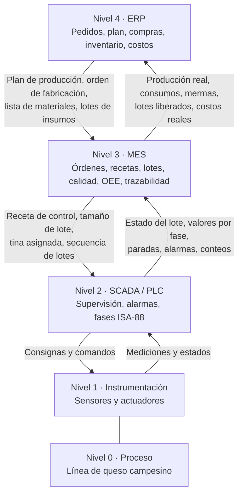

# Necesidades de Información y Relación con MES y ERP — Línea 2: Queso Campesino

> **Alcance:** información que la línea de queso campesino necesita para gestionar la producción (órdenes, lotes, recetas, cantidades, calidad, paradas, trazabilidad e indicadores) y su relación conceptual con los sistemas MES y ERP según ISA-95.

> **Documentos relacionados:** `Modelo_ISA88_Queso.md` (recetas y lotes), `PID_Queso.md` (instrumentos) y `VSM_e_Indicadores_Queso.md` (indicadores).

---

## 1. Ubicación de la información en los niveles ISA-95

| Nivel | Sistema | Función en la línea de quesos | Horizonte |
|---|---|---|---|
| 4 | ERP (SAP S/4HANA como referencia) | Pedidos, plan de producción, compras de leche e insumos, inventarios, costos | Días a semanas |
| 3 | MES | Órdenes de producción, recetas maestras, programación de tinas, trazabilidad, calidad, OEE, paradas | Turnos a horas |
| 2 | SCADA (Ignition) y PLC | Supervisión, alarmas, tendencias, ejecución de fases ISA-88 | Segundos a minutos |
| 1 | Sensores y actuadores | Medición y actuación (34 tags del P&ID) | Milisegundos a segundos |
| 0 | Proceso físico | Recepción, pasteurización, coagulación, prensado, empaque | — |



---

## 2. Información que baja (de IT a OT)

| Información | Origen | Destino | Contenido | Frecuencia |
|---|---|---|---|---|
| Plan de producción | ERP | MES | Kilogramos por presentación (QC-250, QC-1K, QC-3K) y fecha de entrega | Diaria / semanal |
| Orden de fabricación | ERP | MES | Número de orden, presentación, cantidad, fecha | Por pedido |
| Lista de materiales (BOM) | ERP | MES | Leche, CaCl₂, cuajo, sal y empaque por lote | Por versión de receta |
| Disponibilidad de insumos | ERP | MES | Lotes de insumos liberados por calidad e inventario | Continua |
| Orden de producción y programa de tinas | MES | SCADA / PLC | Secuencia de lotes, tina asignada (V-201 o V-202), hora de inicio | Por turno |
| Receta de control | MES | PLC | Receta maestra con parámetros: peso por molde, tiempo de prensado, volteos, tiempo de enfriamiento, unidades por caja, patrón de estiba | Por lote |
| Orden de mantenimiento | ERP / MES | Operación | Equipo, tarea y ventana de parada | Programada |

## 3. Información que sube (de OT a IT)

| Información | Origen | Destino | Contenido | Frecuencia |
|---|---|---|---|---|
| Leche recibida | FQI-101, laboratorio | MES → ERP | Litros por proveedor, resultados de plataforma, lote de leche | Por carrotanque |
| Registro del PCC de pasteurización | TT-103, TR-103, XV-101 | MES | Curva de temperatura y tiempo, eventos de desvío | Continua |
| Registro del lote (*batch record*) | PLC | MES | Valores reales por fase: volúmenes dosificados, temperaturas, tiempos, velocidad de liras | Por fase |
| Cantidades producidas | WT-201, checkweigher, contadores | MES → ERP | Moldes, unidades conformes, unidades rechazadas, kilogramos, cajas y estibas | Por lote |
| Consumos reales | FQ-201, FQ-204, FQ-205 | MES → ERP | Leche, CaCl₂, cuajo, sal y empaque consumidos | Por lote |
| Suero generado | LT-301 | MES → ERP | Kilogramos de suero por lote y destino | Por lote |
| Paradas | PLC / SCADA | MES | Equipo, causa, hora de inicio y duración | Por evento |
| Alarmas | SCADA | MES | Alarma, prioridad, hora y reconocimiento | Por evento |
| Calidad | Laboratorio, checkweigher, detector de metales | MES → ERP | Humedad, pH, sal, peso, rechazos; liberación del lote | Por lote |
| Estado de equipos | PLC | MES | En marcha, detenido, en CIP, en falla | Continua |

---

## 4. Modelo de datos mínimo

| Entidad | Atributos principales |
|---|---|
| Orden de producción | Número, presentación, cantidad programada (kg y unidades), fecha, estado |
| Lote | `QC-AAAAMMDD-NN`, orden, receta maestra y versión, tina, hora de inicio y fin, estado ISA-88 |
| Receta | Código (RM-QC-250, RM-QC-1K, RM-QC-3K), versión, fórmula, parámetros de procedimiento |
| Consumo de materiales | Lote, material, lote del proveedor, cantidad teórica y real |
| Registro de fase | Lote, fase, consigna, valor real, hora de inicio y fin |
| Producción | Lote, unidades conformes, unidades rechazadas y causa, kg, cajas, estibas |
| Parada | Equipo, causa (planeada o no planeada), inicio, duración |
| Resultado de calidad | Lote, variable, valor, límite, conforme o no conforme |
| Estiba | Código SSCC, lote, cajas, ubicación en cámara, fecha de vencimiento |

---

## 5. Trazabilidad

La trazabilidad es de extremo a extremo y en los dos sentidos:

```
Proveedor de leche → lote de leche cruda (silo) → lote de leche pasteurizada (T-102)
   → lote de queso (tina) → moldes → unidades empacadas → cajas → estiba (SSCC) → despacho → cliente
```

- **Hacia atrás:** a partir del lote impreso en una unidad se obtiene la tina, la curva de pasteurización, los lotes de leche e insumos y los proveedores.
- **Hacia adelante:** a partir de un lote de leche o de insumo se obtienen todos los lotes de queso, las estibas y los despachos afectados.

Cada unidad lleva el lote, la fecha de fabricación y la de vencimiento. Cada caja y cada estiba llevan un código de barras que el MES asocia al lote.

---

## 6. Indicadores que calcula el MES

| Indicador | Datos de entrada | Fuente |
|---|---|---|
| OEE (A · PE · Q) | Tiempo planeado, paradas, lotes producidos, unidades conformes | PLC / SCADA |
| Takt time y cumplimiento del plan | Demanda (ERP) y producción real | ERP y MES |
| Throughput (kg por turno) | Kilogramos conformes por turno | Checkweigher |
| MLT por lote | Hora de inicio en tina y hora de entrada a cámara | Registro del lote |
| Rendimiento (L de leche por kg de queso) | FQ-201 y kilogramos producidos | PLC |
| Mermas y rechazos | Unidades rechazadas por causa | Checkweigher, detector de metales |
| Utilización de tinas y prensas | Tiempo en marcha sobre tiempo disponible | PLC |
| MTBF y MTTR | Eventos de falla y duración | SCADA |
| Consumo de servicios por lote | Vapor, agua helada, energía | Medidores |

---

## 7. Situación actual y propuesta

| Aspecto | Actual | Propuesto |
|---|---|---|
| Órdenes de producción | En papel, por turno | Electrónicas, del ERP al MES |
| Recetas | Hojas de proceso, ajuste manual | Recetas maestras ISA-88 descargadas al PLC |
| Registro de lote | Manual | Automático por fase |
| Paradas | No se registran de forma sistemática | Captura automática con causa |
| Trazabilidad | Parcial, en planillas | Completa y en los dos sentidos |
| Indicadores | Calculados a fin de mes | En línea, por turno y por lote |

---

## 8. Referencias

- ANSI/ISA-95 (IEC 62264), *Enterprise-Control System Integration*.
- Material del curso APM 2026-2: *Diapositivas MES y ERP* y *Gestión de Producción Automatizada*.
- Alpina, *Alpina presenta su proyecto de Transformación Digital* (SAP S/4HANA): https://alpina.com/contenidos/post/alpina-presenta-su-proyecto-de-transformacion-digital
