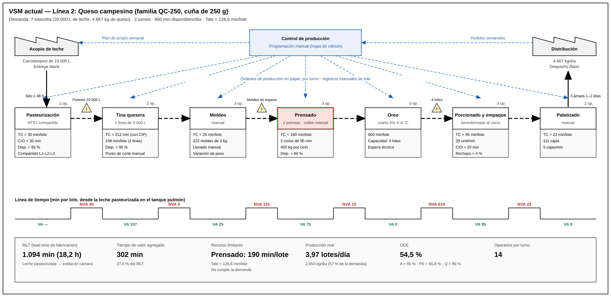
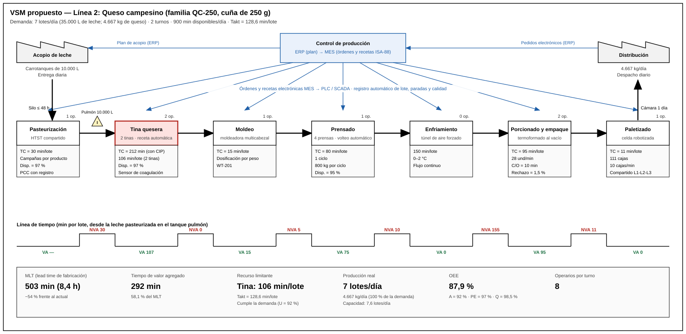

# VSM e Indicadores de Producción — Línea 2: Queso Campesino

> **Alcance:** mapa de flujo de valor (VSM) actual y propuesto de la línea de queso campesino, con los indicadores de producción antes y después de la propuesta de automatización.

> **Base documental:** `Receta_y_Parametros_Queso.md` y `Cuello_de_Botella_Queso.md` (tiempos por estación). Las fórmulas son las del módulo *Gestión de Producción Automatizada* del curso.

> **Nota:** la demanda, las disponibilidades y las tasas de calidad son supuestos de la propuesta inicial. Se ajustarán con la simulación en Siemens Tecnomatix y con la visita técnica a Alpina Sopó (27 y 28 de octubre de 2026).

---

## 1. Datos de partida

| Dato | Valor | Observación |
|---|---|---|
| Demanda de la línea | **7 lotes/día** = 35.000 L de leche = 4.667 kg de queso | Supuesto de diseño |
| Mezcla de producción | 4 lotes de QC-250, 2 de QC-1K y 1 de QC-3K | 57 % / 29 % / 14 % |
| Turnos | 2 turnos de 8 h | |
| Tiempo de ejecución planeado (Tep) | 900 min/día | 960 min menos 60 min de pausas |
| Tamaño de lote (Q) | 5.000 L → 666,7 kg | Una tina |
| Días de operación | 300 días/año | |

---

## 2. VSM actual

**Lectura del mapa:**

- El flujo es de empuje (*push*): cada estación produce según un programa en papel y entrega a la siguiente sin señal de demanda.
- La información es manual: órdenes de producción impresas, registros de lote a mano y sin datos en tiempo real de paradas ni de calidad.
- El **prensado** es el recurso limitante: 190 min por lote frente a un takt de 128,6 min.
- El **oreo** concentra el 55 % del tiempo de fabricación.

## 3. VSM propuesto

**Cambios frente al mapa actual:**

| Estación | Actual | Propuesto |
|---|---|---|
| Tina | Punto de corte verificado a mano | Sensor de coagulación y receta automática (ISA-88) |
| Moldeo | Manual, 3 operarios | Moldeadora multicabezal por peso |
| Prensado | 2 prensas, carga y volteo manual, 2 ciclos | 4 prensas con volteo automático, 1 ciclo |
| Enfriamiento | Cuarto de oreo, 8–12 h | Túnel de aire forzado, 2–3 h |
| Paletizado | Manual, 2 operarios | Celda robotizada compartida |
| Información | Papel y hojas de cálculo | ERP → MES → PLC / SCADA, con registro automático |

---

## 4. Indicadores

### 4.1 Takt time

`T = TD / D`

| | Valor |
|---|---|
| TD (tiempo neto disponible) | 900 min/día |
| D (demanda) | 7 lotes/día |
| **Takt** | **128,6 min/lote** (equivale a 11,6 s por kg de queso) |

### 4.2 Tiempo de ciclo del recurso limitante

| | QC-250 | QC-1K | QC-3K | Promedio ponderado (4-2-1) |
|---|---:|---:|---:|---:|
| Actual: prensado (min/lote) | 190 | 150 | 220 | **182,9** |
| Propuesto: tina (min/lote) | 106 | 106 | 106 | **106** |
| Takt (min/lote) | 128,6 | 128,6 | 128,6 | 128,6 |

En la situación actual el tiempo de ciclo supera al takt en las tres presentaciones, así que la línea no alcanza la demanda. Con la propuesta queda por debajo del takt.

### 4.3 Tiempo total de fabricación (MLT)

`MLT = Σ (Tsu + Q·Tc + Tno)`, medido desde la leche pasteurizada en el tanque pulmón hasta la estiba en la cámara.

| Etapa (min/lote) | QC-250 actual | QC-250 propuesto | QC-1K actual | QC-1K propuesto | QC-3K actual | QC-3K propuesto |
|---|---:|---:|---:|---:|---:|---:|
| Tina (llenado a salado) | 137 | 137 | 137 | 137 | 137 | 137 |
| Moldeo | 25 | 15 | 35 | 15 | 25 | 15 |
| Prensado (con esperas y volteos) | 190 | 80 | 150 | 65 | 220 | 95 |
| Desmoldeo | 15 | 10 | 15 | 10 | 15 | 10 |
| Oreo / enfriamiento | 600 | 150 | 480 | 120 | 720 | 180 |
| Traslado a empaque | 10 | 5 | 10 | 5 | 10 | 5 |
| Porcionado y empaque | 95 | 95 | 33 | 33 | 37 | 37 |
| Encajonado y paletizado | 22 | 11 | 11 | 6 | 11 | 6 |
| **MLT (min)** | **1.094** | **503** | **871** | **391** | **1.175** | **485** |
| **MLT (h)** | **18,2** | **8,4** | **14,5** | **6,5** | **19,6** | **8,1** |
| Tiempo de valor agregado (min) | 302 | 292 | 235 | 215 | 259 | 249 |
| % de valor agregado | 27,6 % | 58,1 % | 27,0 % | 55,0 % | 22,0 % | 51,3 % |

El tiempo de valor agregado cuenta la transformación en la tina (107 min), el moldeo, el tiempo efectivo de prensado y el empaque.

### 4.4 Throughput, capacidad y utilización

`PC = Tep · A · RE / Tc` · `U = Q / PC`

| Indicador | Actual | Propuesto |
|---|---:|---:|
| Tiempo de ciclo del recurso limitante (min/lote) | 182,9 | 106 |
| Capacidad de producción PC (lotes/día) | 3,97 | 7,58 |
| Producción real (lotes/día) | 3,97 | 7,00 |
| **Throughput (kg/día)** | **2.650** | **4.667** |
| Cumplimiento de la demanda | 57 % | 100 % |
| Utilización U | 100 % (saturada) | 92 % |
| Producción por turno (kg) | 1.325 | 2.333 |

### 4.5 OEE

`OEE = A · PE · Q`, con `PE = RE · SE` y `SE = Takt / Tc real` (máximo 1).

| Componente | Actual | Propuesto | Supuesto |
|---|---:|---:|---|
| Disponibilidad A = Ter / Tep | 85 % | 92 % | Menos paradas por operación manual; mantenimiento planificado desde el MES |
| Tasa de eficiencia RE | 95 % | 97 % | Microparadas |
| Eficiencia en velocidad SE | 70,3 % | 100 % | 128,6 / 182,9 en el actual; Tc ≤ takt en el propuesto |
| Eficiencia de desempeño PE | 66,8 % | 97 % | |
| Tasa de calidad Q | 96 % | 98,5 % | Peso fuera de tolerancia, sellado y deformación por volteo manual |
| **OEE** | **54,5 %** | **87,9 %** | |

### 4.6 Trabajo en proceso (WIP)

`WIP ≈ Throughput × MLT`

| | Actual | Propuesto |
|---|---:|---:|
| MLT promedio ponderado (min) | 1.042 | 468 |
| Intervalo entre lotes (min) | 227 | 128,6 |
| **WIP (lotes)** | **4,6** | **3,6** |
| WIP (kg de queso) | 3.070 | 2.430 |

El WIP baja un 21 % aunque el throughput sube un 76 %, porque el túnel de enfriamiento reduce el inventario en oreo.

### 4.7 Resumen comparativo

| Indicador | Actual | Propuesto | Variación |
|---|---:|---:|---:|
| Takt (min/lote) | 128,6 | 128,6 | — |
| Tc del recurso limitante (min/lote) | 182,9 (prensado) | 106 (tina) | −42 % |
| MLT promedio (h) | 17,4 | 7,8 | −55 % |
| % de valor agregado (QC-250) | 27,6 % | 58,1 % | +30,5 puntos |
| Throughput (kg/día) | 2.650 | 4.667 | +76 % |
| Cumplimiento de la demanda | 57 % | 100 % | +43 puntos |
| OEE | 54,5 % | 87,9 % | +33,4 puntos |
| WIP (lotes) | 4,6 | 3,6 | −21 % |
| Operarios por turno | 14 | 8 | −6 |

---

## 5. Datos de entrada para la simulación en Tecnomatix

| Objeto | Parámetro | Actual | Propuesto |
|---|---|---|---|
| Fuente (leche pasteurizada) | Intervalo de llegada | 1 lote cada 128,6 min | Igual |
| Tina (2 en paralelo) | Tiempo de proceso (llenado a salado) | 137 min | 137 min |
| | Tiempo de setup (CIP) | 50 min | 50 min |
| Moldeo | Tiempo de proceso | 25 / 35 / 25 min | 15 min |
| Prensado | Capacidad | 2 prensas × 200 kg | 4 prensas × 200 kg |
| | Tiempo de proceso por ciclo | 95 / 75 / 110 min | 80 / 65 / 95 min |
| | Disponibilidad / MTTR | 90 % / 30 min | 95 % / 20 min |
| Oreo / túnel | Tiempo de proceso | 600 / 480 / 720 min | 150 / 120 / 180 min |
| | Capacidad | 4 lotes | Flujo continuo |
| Porcionado y empaque | Tiempo de proceso | 95 / 33 / 37 min | Igual |
| | Setup por cambio de presentación | 20 min | 10 min |
| Paletizado | Tiempo de proceso | 22 / 11 / 11 min | 11 / 6 / 6 min |
| Calidad | % de rechazo | 4 % | 1,5 % |
| Turnos | Calendario | 2 × 8 h, 60 min de pausas | Igual |

Los tres valores separados por barras corresponden a QC-250, QC-1K y QC-3K.

---

## 6. Referencias

- Material del curso APM 2026-2: *Gestión de Producción Automatizada* e *Indicadores de Gestión*.
- Rother, M. y Shook, J., *Learning to See: Value Stream Mapping to Add Value and Eliminate Muda*, Lean Enterprise Institute.
- Tetra Pak, *Dairy Processing Handbook*, cap. 14 (Cheese).
