# EDT — Proceso Productivo de una Línea de Queso Campesino

> **Alcance:** Proceso productivo de una línea de queso fresco tipo campesino, no madurado, prensado y salado, elaborado con una receta única y comercializado en tres presentaciones: QC-250 (cuña de 250 g), QC-1K (1 kg) y QC-3K (bloque de 3 kg).

> **Metodología:** EDT de tres niveles según PMBOK (Proyecto → Entregable / cuenta de control → Paquete de trabajo), con la regla del 100 % y la regla 8–80.

> **Fuentes complementarias:** PMBOK (EDT/WBS), Decreto 616 de 2006, NTC 750, Resolución 2674 de 2013 (BPM), Tetra Pak *Dairy Processing Handbook* (cap. 14, Cheese), FAO/OMS (HACCP).

---

## 1. Resumen de la EDT

| Código | Entregable | Paquetes | Horas |
|---|---|---|---:|
| 1.1 | Materias primas recepcionadas y almacenadas | 4 | 76 |
| 1.2 | Leche estandarizada y pasteurizada | 3 | 60 |
| 1.3 | Cuajada elaborada y salada | 5 | 84 |
| 1.4 | Queso formado y enfriado | 4 | 84 |
| 1.5 | Queso empacado, inspeccionado y codificado | 4 | 76 |
| 1.6 | Producto terminado almacenado y despachado | 3 | 56 |
| 1.7 | Sistema de calidad, inocuidad y soporte | 5 | 136 |
| | **Total** | **28** | **572** |

> Las horas son estimaciones referenciales por lote / campaña de arranque y sirven para dimensionar y detectar riesgo. La EDT dice *qué* se entrega; el cronograma dice *cuándo*.

---

## 2. Diagrama de la EDT

```mermaid
graph TD
    P["1.0 Línea de queso campesino"]
    P --> A["1.1 Materias primas<br/>recepcionadas y almacenadas"]
    P --> B["1.2 Leche estandarizada<br/>y pasteurizada"]
    P --> C["1.3 Cuajada elaborada<br/>y salada"]
    P --> D["1.4 Queso formado<br/>y enfriado"]
    P --> E["1.5 Queso empacado,<br/>inspeccionado y codificado"]
    P --> F["1.6 Producto terminado<br/>almacenado y despachado"]
    P --> G["1.7 Sistema de calidad,<br/>inocuidad y soporte"]

    A --> A1["1.1.1 Recepción y control<br/>de leche cruda"]
    A --> A2["1.1.2 Almacenamiento<br/>refrigerado en silo"]
    A --> A3["1.1.3 Recepción y control<br/>de insumos"]
    A --> A4["1.1.4 Almacenamiento<br/>de insumos"]

    B --> B1["1.2.1 Clarificación<br/>y bactofugación"]
    B --> B2["1.2.2 Estandarización<br/>de materia grasa"]
    B --> B3["1.2.3 Pasteurización HTST<br/>y enfriamiento"]

    C --> C1["1.3.1 Llenado de tina<br/>y premaduración"]
    C --> C2["1.3.2 Coagulación<br/>enzimática"]
    C --> C3["1.3.3 Corte y agitación<br/>de la cuajada"]
    C --> C4["1.3.4 Desuerado"]
    C --> C5["1.3.5 Salado<br/>de la cuajada"]

    D --> D1["1.4.1 Moldeo"]
    D --> D2["1.4.2 Prensado<br/>y volteo"]
    D --> D3["1.4.3 Desmoldeo y<br/>lavado de moldes"]
    D --> D4["1.4.4 Oreo y<br/>enfriamiento"]

    E --> E1["1.5.1 Porcionado"]
    E --> E2["1.5.2 Empaque<br/>al vacío"]
    E --> E3["1.5.3 Inspección<br/>en línea"]
    E --> E4["1.5.4 Codificación<br/>y etiquetado"]

    F --> F1["1.6.1 Encajonado y<br/>paletizado robotizado"]
    F --> F2["1.6.2 Almacenamiento refrigerado<br/>y liberación de lote"]
    F --> F3["1.6.3 Despacho en<br/>cadena de frío"]

    G --> G1["1.7.1 Plan HACCP<br/>y PCC"]
    G --> G2["1.7.2 CIP<br/>entre lotes"]
    G --> G3["1.7.3 Manejo<br/>del suero"]
    G --> G4["1.7.4 Trazabilidad y<br/>registros de lote"]
    G --> G5["1.7.5 Gestión del proyecto<br/>y coordinación"]
```

---

## 3. Árbol de la EDT

### 1.0 Proceso productivo de la línea de queso campesino

**1.1 Materias primas recepcionadas y almacenadas**
- 1.1.1 Recepción y control de la leche cruda
- 1.1.2 Almacenamiento refrigerado de la leche cruda en silo
- 1.1.3 Recepción y control de insumos (CaCl₂, cuajo, sal, material de empaque)
- 1.1.4 Almacenamiento y acondicionamiento de insumos

**1.2 Leche estandarizada y pasteurizada**
- 1.2.1 Clarificación y bactofugación
- 1.2.2 Estandarización de materia grasa
- 1.2.3 Pasteurización HTST y enfriamiento a temperatura de coagulación

**1.3 Cuajada elaborada y salada**
- 1.3.1 Llenado de la tina y premaduración (CaCl₂)
- 1.3.2 Coagulación enzimática
- 1.3.3 Corte y agitación de la cuajada
- 1.3.4 Desuerado
- 1.3.5 Salado de la cuajada

**1.4 Queso formado y enfriado**
- 1.4.1 Moldeo
- 1.4.2 Prensado y volteo
- 1.4.3 Desmoldeo y lavado de moldes
- 1.4.4 Oreo y enfriamiento

**1.5 Queso empacado, inspeccionado y codificado**
- 1.5.1 Porcionado
- 1.5.2 Empaque al vacío
- 1.5.3 Inspección en línea (metales, peso y sellado)
- 1.5.4 Codificación y etiquetado

**1.6 Producto terminado almacenado y despachado**
- 1.6.1 Encajonado y paletizado robotizado
- 1.6.2 Almacenamiento refrigerado y liberación de lote
- 1.6.3 Despacho en cadena de frío

**1.7 Sistema de calidad, inocuidad y soporte**
- 1.7.1 Diseño del plan HACCP y determinación de PCC
- 1.7.2 CIP (Cleaning In Place) entre lotes
- 1.7.3 Manejo del suero (subproducto)
- 1.7.4 Trazabilidad de lotes y registros
- 1.7.5 Gestión del proyecto, reuniones y coordinación

---

## 4. Diccionario de la EDT

| Código | Paquete de trabajo | Descripción (incluye / no incluye) | Criterio de aceptación | Responsable (rol) | Est. (h) | Depende de |
|---|---|---|---|---|---:|---|
| 1.1.1 | Recepción y control de leche cruda | **Incluye:** descarga del carrotanque, filtrado (100–200 µm), medición por caudalímetro másico, pruebas de plataforma: temperatura (≤ 6 °C), alcohol 68–72 %, acidez (0,13–0,17 %), densidad (1,030–1,033), grasa, proteína, antibióticos y crioscopia. **No incluye:** gestión comercial con el proveedor. | Leche aceptada con todos los parámetros en especificación y registro de lote de proveedor. | Jefe de Recepción / Calidad | 24 | — |
| 1.1.2 | Almacenamiento refrigerado en silo | **Incluye:** enfriamiento en placas a ≤ 4 °C, bombeo a silo, agitación periódica, control de nivel y temperatura, rotación FIFO (máx. 48 h). **No incluye:** CIP de silos (1.7.2). | Leche conservada ≤ 4 °C sin desvíos durante el almacenamiento. | Operador de Planta | 16 | 1.1.1 |
| 1.1.3 | Recepción y control de insumos | **Incluye:** CaCl₂, cuajo (quimosina), sal grado alimenticio, sorbato (si aplica), bolsas, etiquetas y cajas; verificación de certificados, lotes y temperatura. **No incluye:** control de leche cruda (1.1.1). | Insumos conformes con certificado y cuarentena liberada. | Jefe de Recepción / Calidad | 20 | — |
| 1.1.4 | Almacenamiento y acondicionamiento de insumos | **Incluye:** almacén seco (sal, CaCl₂, empaque) y cámara refrigerada (cuajo); inventario. **No incluye:** dosificación en tina (1.3.1, 1.3.2). | Insumos almacenados en la condición especificada, sin desvíos. | Jefe de Almacén | 16 | 1.1.3 |
| 1.2.1 | Clarificación y bactofugación | **Incluye:** remoción de impurezas y esporas por centrifugación en línea. **No incluye:** estandarización de grasa (1.2.2). | Leche clarificada sin sedimento visible; lodos descargados y registrados. | Operador de Planta | 16 | 1.1.2 |
| 1.2.2 | Estandarización de materia grasa | **Incluye:** separación de crema y ajuste en línea a 3,0 % de grasa con el cuadro de Pearson o un analizador en línea. **No incluye:** pasteurización (1.2.3). | Materia grasa dentro de ± 0,1 % del objetivo. | Supervisor de Producción | 20 | 1.2.1 |
| 1.2.3 | Pasteurización HTST y enfriamiento | **Incluye:** tratamiento en intercambiador de placas a 72–75 °C durante 15–20 s, con válvula de desvío de flujo (FDV) y registro continuo; enfriamiento a 32–35 °C. **No incluye:** pasteurización a 85–95 °C de las líneas de yogur y kumis. | Curva tiempo-temperatura conforme; prueba de fosfatasa alcalina negativa. | Operador de Planta | 24 | 1.2.2 |
| 1.3.1 | Llenado de la tina y premaduración | **Incluye:** llenado de la tina de 5.000 L; dosificación de CaCl₂ (20 g/100 L); 15 min con agitación suave. **No incluye:** adición de cuajo (1.3.2). | Leche a 32–35 °C con aditivos dosificados según la receta. | Operador de Quesería | 16 | 1.2.3, 1.1.4 |
| 1.3.2 | Coagulación enzimática | **Incluye:** dosificación de cuajo (25 IMCU/L), agitación de 2–3 min, reposo de 35 min a 33 °C y verificación del punto de corte (corte limpio, suero translúcido). **No incluye:** corte (1.3.3). | Gel con firmeza de corte alcanzada en el tiempo previsto. | Operador de Quesería | 24 | 1.3.1 |
| 1.3.3 | Corte y agitación de la cuajada | **Incluye:** corte con liras en cubos de 2 cm; reposo y agitación progresiva de 15–25 min a 32–36 °C. **No incluye:** retiro de suero (1.3.4). | Grano de tamaño uniforme y firmeza adecuada. | Operador de Quesería | 16 | 1.3.2 |
| 1.3.4 | Desuerado | **Incluye:** retiro del 50–70 % del suero hacia el tanque de suero y desuerado final en mesa o tamiz. **No incluye:** manejo del suero como subproducto (1.7.3). | Volumen de suero retirado conforme; cuajada lista para salar. | Operador de Quesería | 16 | 1.3.3 |
| 1.3.5 | Salado de la cuajada | **Incluye:** adición de sal en la tina (1,8 % sobre el peso del queso) y mezcla homogénea. **No incluye:** análisis de laboratorio del producto terminado (1.6.2). | Sal dosificada según la receta; mezcla homogénea. | Operador de Quesería | 12 | 1.3.4 |
| 1.4.1 | Moldeo | **Incluye:** llenado de moldes perforados por peso según la presentación: moldes de 3 kg para QC-250 (se porcionan después) y QC-3K, y moldes de 1 kg para QC-1K. **No incluye:** prensado (1.4.2). | Moldes llenos dentro de la tolerancia de peso. | Operador de Quesería | 20 | 1.3.5 |
| 1.4.2 | Prensado y volteo | **Incluye:** prensado neumático de 75 min (QC-250), 60 min (QC-1K) o 90 min con 2 volteos (QC-3K). **No incluye:** desmoldeo (1.4.3). | Queso con forma, cierre de superficie y humedad conformes. | Operador de Quesería | 32 | 1.4.1 |
| 1.4.3 | Desmoldeo y lavado de moldes | **Incluye:** retiro del queso del molde y lavado y sanitización de moldes para el siguiente lote. **No incluye:** CIP de la tina (1.7.2). | Queso íntegro; moldes limpios y disponibles. | Operador de Quesería | 16 | 1.4.2 |
| 1.4.4 | Oreo y enfriamiento | **Incluye:** permanencia en cuarto frío a 4–6 °C y humedad relativa de 85–90 % durante 8 h (QC-1K), 10 h (QC-250) o 12 h (QC-3K). **No incluye:** almacenamiento de producto terminado (1.6.2). | Temperatura interna ≤ 6 °C y superficie firme. | Operador de Quesería | 16 | 1.4.3 |
| 1.5.1 | Porcionado | **Incluye:** corte del bloque de 3 kg en 12 cuñas de 250 g (solo QC-250), con tolerancia de ± 2 %. **No incluye:** empaque (1.5.2). | Porciones dentro de la tolerancia de peso. | Operador de Empaque | 16 | 1.4.4 |
| 1.5.2 | Empaque al vacío | **Incluye:** termoformado al vacío (QC-250), bolsa termoencogible (QC-1K) o bolsa de cámara (QC-3K); vacío ≥ 95 % y sellado a 130–160 °C. **No incluye:** inspección (1.5.3). | Unidades empacadas y selladas sin fugas. | Operador de Empaque | 32 | 1.5.1 |
| 1.5.3 | Inspección en línea | **Incluye:** detector de metales, control de peso (checkweigher) con rechazo automático, verificación de sellado; pesaje individual de QC-3K para el etiquetado de peso variable. **No incluye:** liberación del lote (1.6.2). | Cero unidades no conformes aguas abajo; rechazos registrados. | Inspector de Calidad | 16 | 1.5.2 |
| 1.5.4 | Codificación y etiquetado | **Incluye:** impresión de lote, fecha de fabricación, vencimiento y código de barras o QR según la Res. 5109 de 2005; en QC-3K, etiqueta de peso variable con peso neto real y precio por kg. **No incluye:** diseño gráfico de la etiqueta. | Códigos legibles y correctos al 100 %. | Operador de Empaque | 12 | 1.5.3 |
| 1.6.1 | Encajonado y paletizado robotizado | **Incluye:** armado de cajas (24, 12 o 4 und/caja según la referencia), paletizado con robot según el patrón de cada referencia y estirado con film. **No incluye:** transporte (1.6.3). | Estibas completas, estables e identificadas. | Técnico de Automatización | 24 | 1.5.4 |
| 1.6.2 | Almacenamiento refrigerado y liberación de lote | **Incluye:** ingreso a cámara a 2–6 °C, rotación FEFO y liberación del lote con resultados de calidad (vida útil de 18–20 días). **No incluye:** gestión comercial de pedidos. | Lote liberado con resultados conformes. | Microbiólogo / QA | 16 | 1.6.1 |
| 1.6.3 | Despacho en cadena de frío | **Incluye:** carga y transporte refrigerado a ≤ 6 °C con registro de temperatura. **No incluye:** facturación. | Producto entregado a ≤ 6 °C con registro de la cadena de frío. | Jefe de Logística | 16 | 1.6.2 |
| 1.7.1 | Plan HACCP y PCC | **Incluye:** análisis de peligros, PCC de pasteurización (≥ 72 °C / 15 s) y detector de metales, límites críticos y acciones correctivas. **No incluye:** certificación externa. | Plan HACCP documentado y aprobado. | Coordinador HACCP | 40 | — |
| 1.7.2 | CIP entre lotes | **Incluye:** limpieza en circuito de silo, pasteurizador, tina y tuberías: enjuague, soda al 1–2 % a 75 °C, enjuague, ácido nítrico al 0,5–1 % a 65 °C y enjuague final, con verificación por conductividad y ATP. **No incluye:** lavado de moldes (1.4.3). | Protocolo ejecutado y verificado (ATP conforme). | Coordinador HACCP | 24 | 1.7.1 |
| 1.7.3 | Manejo del suero | **Incluye:** recolección en tanque refrigerado, control de volumen y destino (bebidas, concentrado o alimento animal). **No incluye:** procesamiento del suero en otra planta. | Suero almacenado ≤ 6 °C y despachado con registro. | Supervisor de Producción | 16 | 1.3.4 |
| 1.7.4 | Trazabilidad de lotes y registros | **Incluye:** expediente de lote (leche de proveedor → lote de queso → despacho), registros de PCC y paradas. **No incluye:** contabilidad de costos. | Trazabilidad hacia atrás y hacia adelante demostrable. | Microbiólogo / QA | 32 | 1.7.1 |
| 1.7.5 | Gestión del proyecto y coordinación | **Incluye:** planificación, seguimiento del avance, reuniones y control de cambios del alcance. **No incluye:** ejecución técnica de los demás paquetes. | EDT actualizada, actas y control de cambios vigentes. | Project Manager | 24 | — |

---

## 5. Parámetros clave del proceso

| Etapa | Parámetro crítico | Valor |
|---|---|---|
| Recepción de leche cruda | Temperatura / acidez / densidad | ≤ 6 °C / 0,13–0,17 % / 1,030–1,033 |
| Estandarización | Materia grasa | 3,0 % |
| Pasteurización | Temperatura / tiempo | 72–75 °C / 15–20 s |
| Premaduración | CaCl₂ / tiempo | 20 g/100 L / 15 min |
| Coagulación | Temperatura / cuajo / tiempo | 33 °C / 25 IMCU/L / 35 min |
| Corte | Tamaño del grano | 2 cm |
| Salado | % sobre el peso del queso | 1,8 % |
| Prensado | Tiempo / volteos | 75 min, 1 volteo (QC-250); 60 min, 1 volteo (QC-1K); 90 min, 2 volteos (QC-3K) |
| Oreo | Temperatura / tiempo | 4–6 °C / 8–12 h según la presentación |
| Empaque | Vacío / sellado | ≥ 95 % / 130–160 °C |
| Almacenamiento y despacho | Temperatura / vida útil | 2–6 °C / 18–20 días |

---

## 6. Referencias

- `Proceso_Queso_Campesino.md`: materias primas, maquinaria, etapas y parámetros del proceso (documento base).
- Project Management Institute, *PMBOK Guide* (EDT/WBS, cuenta de control y paquete de trabajo).
- Decreto 616 de 2006; ICONTEC NTC 750; Resolución 2674 de 2013; Resolución 5109 de 2005.
- Tetra Pak, *Dairy Processing Handbook*, cap. 14 (Cheese).
- FAO/OMS, *Codex Alimentarius*: principios de HACCP.
