# EDT — Proceso Productivo de una Línea de Yogur Saborizado con Fruta

> **Alcance:** Proceso productivo de una línea de yogur batido saborizado con fruta (con adición de preparación de fruta antes del envasado).

> **Metodología:** EDT de tres niveles según PMBOK (Proyecto → Entregable / cuenta de control → Paquete de trabajo), con la regla del 100 % y la regla 8–80.

> **Fuentes complementarias:** PMBOK (EDT/WBS), FAO/OMS y Codex Alimentarius (leches fermentadas, HACCP), Wikipedia (Yogur) para tipos de yogur, envasado y cadena de frío.

---

## 1. Qué es la EDT y cómo se lee este documento

La **EDT** descompone el proyecto en **entregables** (sustantivos: cosas que existen al terminar) y **paquetes de trabajo** (la unidad mínima que se puede estimar en horas y asignar a una persona). No es una lista de tareas ni el organigrama del equipo.

Se usan **tres niveles**:

| Nivel | Código | Qué es | En este EDT |
|---|---|---|---|
| Proyecto | `1.0` | El resultado completo | Proceso productivo de la línea de yogur saborizado con fruta |
| Entregable (cuenta de control) | `1.1` | Algo que existe al terminar una fase; aquí se controlan plazo y presupuesto | Yogur saborizado y envasado |
| Paquete de trabajo | `1.1.1` | Unidad estimable y asignable (8–80 h) | Envasado del yogur |

**Reglas aplicadas:**

- **Regla del 100 %:** la suma de los hijos de cada elemento da exactamente el padre (todo el alcance está, y nada dos veces).
- **Regla 8–80:** cada paquete de trabajo se estima entre 8 y 80 horas. Por debajo es microgestión; por encima es una caja negra.

---

## 2. Resumen de la EDT

| Código | Entregable | Paquetes | Horas |
|---|---|---|---:|
| 1.1 | Materias primas recepcionadas y almacenadas | 4 | 76 |
| 1.2 | Leche acondicionada (mezcla normalizada y homogeneizada) | 4 | 76 |
| 1.3 | Mezcla pasteurizada y enfriada | 3 | 52 |
| 1.4 | Yogur fermentado (coágulo cortado) | 4 | 88 |
| 1.5 | Yogur saborizado con fruta y envasado | 3 | 72 |
| 1.6 | Producto terminado almacenado y distribuido | 3 | 56 |
| 1.7 | Sistema de gestión de calidad e inocuidad (HACCP/PCC) | 4 | 120 |
| | **Total** | **25** | **540** |

> Las horas son **estimaciones referenciales por lote / campaña de arranque** y sirven para dimensionar y detectar riesgo. No sustituyen al cronograma: la EDT dice *qué* se entrega, el cronograma dice *cuándo*.

---

## 3. Diagrama de la EDT

```mermaid
graph TD
    P["1.0 Línea de yogur<br/>saborizado con fruta"]
    P --> A["1.1 Materias primas<br/>recepcionadas y almacenadas"]
    P --> B["1.2 Leche acondicionada<br/>(mezcla normalizada)"]
    P --> C["1.3 Mezcla pasteurizada<br/>y enfriada"]
    P --> D["1.4 Yogur fermentado<br/>(coágulo cortado)"]
    P --> E["1.5 Yogur saborizado<br/>con fruta y envasado"]
    P --> F["1.6 Producto terminado<br/>almacenado y distribuido"]
    P --> G["1.7 Sistema de calidad<br/>e inocuidad HACCP/PCC"]

    A --> A1["1.1.1 Recepción y control<br/>de leche cruda"]
    A --> A2["1.1.2 Almacenamiento<br/>refrigerado de leche"]
    A --> A3["1.1.3 Recepción y control<br/>de insumos"]
    A --> A4["1.1.4 Almacenamiento<br/>de insumos"]

    B --> B1["1.2.1 Estandarización<br/>de materia grasa"]
    B --> B2["1.2.2 Normalización de<br/>sólidos totales"]
    B --> B3["1.2.3 Homogeneización"]
    B --> B4["1.2.4 Formulación y<br/>dosificación de aditivos"]

    C --> C1["1.3.1 Pasteurización"]
    C --> C2["1.3.2 Enfriamiento a<br/>temperatura de inoculación"]
    C --> C3["1.3.3 Verificación<br/>post-tratamiento"]

    D --> D1["1.4.1 Inoculación<br/>con cultivos starter"]
    D --> D2["1.4.2 Fermentación<br/>controlada"]
    D --> D3["1.4.3 Corte de<br/>fermentación"]
    D --> D4["1.4.4 Control del punto<br/>de coagulación"]

    E --> E1["1.5.1 Preparación y dosificación<br/>de fruta y saborizante"]
    E --> E2["1.5.2 Envasado del yogur"]
    E --> E3["1.5.3 Etiquetado y<br/>codificación"]

    F --> F1["1.6.1 Almacenamiento<br/>refrigerado a 4 °C"]
    F --> F2["1.6.2 Liberación de lote y<br/>verificación de vida útil"]
    F --> F3["1.6.3 Distribución en<br/>cadena de frío"]

    G --> G1["1.7.1 Diseño del plan<br/>HACCP y PCC"]
    G --> G2["1.7.2 CIP entre lotes"]
    G --> G3["1.7.3 Documentación y<br/>trazabilidad"]
    G --> G4["1.7.4 Gestión del proyecto<br/>y coordinación"]
```

---

## 4. Desglose detallado (árbol EDT)

### 1.0 Proceso productivo de la línea de yogur saborizado con fruta

**1.1 Materias primas recepcionadas y almacenadas**
- 1.1.1 Recepción y control de la leche cruda
- 1.1.2 Almacenamiento refrigerado de la leche cruda
- 1.1.3 Recepción y control de insumos
- 1.1.4 Almacenamiento y acondicionamiento de insumos

**1.2 Leche acondicionada (mezcla normalizada y homogeneizada)**
- 1.2.1 Estandarización de materia grasa
- 1.2.2 Normalización de sólidos totales
- 1.2.3 Homogeneización
- 1.2.4 Formulación y dosificación de azúcar y estabilizantes

**1.3 Mezcla pasteurizada y enfriada**
- 1.3.1 Pasteurización
- 1.3.2 Enfriamiento a temperatura de inoculación
- 1.3.3 Verificación microbiológica y fisicoquímica post-tratamiento

**1.4 Yogur fermentado (coágulo cortado)**
- 1.4.1 Inoculación con cultivos starter
- 1.4.2 Fermentación controlada
- 1.4.3 Corte de fermentación por enfriamiento
- 1.4.4 Control del punto de coagulación

**1.5 Yogur saborizado con fruta y envasado**
- 1.5.1 Preparación y dosificación de la preparación de fruta y saborizante
- 1.5.2 Envasado del yogur
- 1.5.3 Etiquetado, codificación y control de sellado

**1.6 Producto terminado almacenado y distribuido**
- 1.6.1 Almacenamiento refrigerado a 4 °C
- 1.6.2 Liberación de lote y verificación de vida útil
- 1.6.3 Distribución en cadena de frío

**1.7 Sistema de gestión de calidad e inocuidad (HACCP/PCC)**
- 1.7.1 Diseño del plan HACCP y determinación de PCC
- 1.7.2 CIP (Cleaning In Place) entre lotes
- 1.7.3 Documentación, trazabilidad de lotes y registros
- 1.7.4 Gestión del proyecto, reuniones y coordinación

---

## 5. Diccionario de la EDT

Cada paquete indica qué incluye, qué **no** incluye, cómo se sabe que está terminado, quién responde, la estimación y de qué depende.

| Código | Paquete de trabajo | Descripción (incluye / no incluye) | Criterio de aceptación | Responsable (rol) | Est. (h) | Depende de |
|---|---|---|---|---|---:|---|
| 1.1.1 | Recepción y control de leche cruda | **Incluye:** descarga de cisternas refrigeradas, muestreo y análisis de temperatura (<6 °C), antibióticos, recuento bacteriano, grasa, proteína, acidez y densidad (1.028–1.034). **No incluye:** pago a proveedor ni rechazo/gestión comercial. | Leche aceptada con todos los parámetros dentro de especificación y registro firmado. | Jefe de Recepción / Calidad | 24 | — |
| 1.1.2 | Almacenamiento refrigerado de leche cruda | **Incluye:** bombeo a tanques, control de temperatura continua y rotación FIFO. **No incluye:** limpieza CIP de tanques (va en 1.7.2). | Leche conservada <6 °C sin variación fuera de rango por 24 h. | Operador de Planta | 16 | 1.1.1 |
| 1.1.3 | Recepción y control de insumos | **Incluye:** control de leche en polvo descremada, cultivos (S. thermophilus / L. bulgaricus), estabilizantes, azúcar, saborizante y fruta (certificados, lotes, temperatura). **No incluye:** control de leche cruda (1.1.1). | Insumos conformes con certificado y cuarentena liberada. | Jefe de Recepción / Calidad | 20 | — |
| 1.1.4 | Almacenamiento y acondicionamiento de insumos | **Incluye:** almacén seco y cámara refrigerada para cultivos y fruta, control de inventario. **No incluye:** descongelado operativo de cultivos (1.4.1). | Insumos almacenados en condiciones y temperatura especificadas, sin desvíos. | Jefe de Almacén | 16 | 1.1.3 |
| 1.2.1 | Estandarización de materia grasa | **Incluye:** separación de nata por centrífuga y mezcla con leche descremada aplicando el cuadro de Pearson hasta el % graso objetivo (3.0–3.5 % entero / 1.5–1.8 % semidescremado / <0.5 % descremado). **No incluye:** homogeneización (1.2.3). | Materia grasa dentro del rango objetivo (±0.1 %). | Supervisor de Producción | 24 | 1.1.4 |
| 1.2.2 | Normalización de sólidos totales | **Incluye:** adición de leche en polvo descremada hasta ST 14–16 % y SNG 12–14 %; control de sinéresis. **No incluye:** dosificación de azúcar/estabilizantes (1.2.4). | Sólidos totales y SNG dentro de especificación. | Supervisor de Producción | 16 | 1.2.1 |
| 1.2.3 | Homogeneización | **Incluye:** homogenización a 150–200 bar y 60–65 °C en dos etapas, reducción de glóbulos de grasa a <1 µm. **No incluye:** pasteurización (1.3.1), que ocurre después. | Glóbulos <1 µm y ausencia de separación de grasa en reposo. | Operador de Planta | 20 | 1.2.2 |
| 1.2.4 | Formulación y dosificación de azúcar y estabilizantes | **Incluye:** pesaje y dosificación de azúcar y estabilizantes opcionales (pectina, gelatina o almidón modificado) según receta. **No incluye:** fruta ni saborizante (1.5.1). | Mezcla formulada conforme a receta aprobada. | Supervisor de Producción | 16 | 1.2.2 |
| 1.3.1 | Pasteurización | **Incluye:** tratamiento en intercambiador de placas a 85–95 °C durante 5–10 min; destrucción de patógenos y desnaturalización de β-lactoglobulina. **No incluye:** esterilización UHT. | Curva tiempo-temperatura registrada y conforme; prueba de fosfatasa negativa. | Operador de Planta | 24 | 1.2.3, 1.2.4 |
| 1.3.2 | Enfriamiento a temperatura de inoculación | **Incluye:** enfriamiento rápido a 42–45 °C ± 0.5 °C para proteger los cultivos. **No incluye:** inoculación (1.4.1). | Temperatura de la mezcla estabilizada en 42–45 °C. | Operador de Planta | 12 | 1.3.1 |
| 1.3.3 | Verificación microbiológica y fisicoquímica post-tratamiento | **Incluye:** recuento microbiano, pH y sólidos tras el tratamiento térmico; liberación del lote a fermentación. **No incluye:** análisis de materia prima (1.1.1, 1.1.3). | Resultados dentro de especificación; lote liberado. | Microbiólogo / QA | 16 | 1.3.2 |
| 1.4.1 | Inoculación con cultivos starter | **Incluye:** dosificación del cultivo DVS (0.02–0.05 %) con *S. thermophilus* y *L. delbrueckii* subsp. *bulgaricus* en proporción 1:1, sin propagación previa; pH inicial ~6.6. **No incluye:** preparación de cultivo madre. | Cultivo inoculado uniformemente y dosificación registrada. | Microbiólogo / QA | 12 | 1.3.3, 1.1.4 |
| 1.4.2 | Fermentación controlada | **Incluye:** incubación 4–6 h hasta pH objetivo 4.4–4.6 y acidez final 0.85–0.95 %; monitoreo continuo. **No incluye:** corte/enfriamiento (1.4.3). | pH final 4.4–4.6 alcanzado en el tiempo previsto. | Supervisor de Producción | 40 | 1.4.1 |
| 1.4.3 | Corte de fermentación por enfriamiento | **Incluye:** enfriamiento rápido a <15 °C para detener la actividad; agitación para yogur batido (ruptura del coágulo). **No incluye:** envasado (1.5.2). | Actividad microbiana detenida y temperatura <15 °C. | Operador de Planta | 20 | 1.4.2 |
| 1.4.4 | Control del punto de coagulación | **Incluye:** verificación de pH, firmeza del coágulo y ausencia de sinéresis excesiva; decisión de corte. **No incluye:** ajustes de receta (1.2.x). | Coágulo conforme; desviaciones documentadas y corregidas. | Microbiólogo / QA | 16 | 1.4.2 |
| 1.5.1 | Preparación y dosificación de fruta y saborizante | **Incluye:** preparación de la preparación de fruta y saborizante, dosificación antes del envasado, control de temperatura ambiente ≤20 °C. **No incluye:** compra de fruta (1.1.3). | Preparación de fruta dosificada conforme a receta. | Supervisor de Producción | 24 | 1.4.3 |
| 1.5.2 | Envasado del yogur | **Incluye:** llenado y sellado en el formato definido (vaso, botella bebible), dosificación de fruta en línea. **No incluye:** etiquetado (1.5.3). | Envases llenos, sellados y con peso/volumen conforme. | Operador de Envasado | 32 | 1.5.1 |
| 1.5.3 | Etiquetado, codificación y control de sellado | **Incluye:** etiquetado (lote, fecha, vida útil), codificación y verificación de hermeticidad. **No incluye:** diseño gráfico de etiqueta. | Etiquetas y códigos correctos; sellado íntegro verificado. | Operador de Envasado | 16 | 1.5.2 |
| 1.6.1 | Almacenamiento refrigerado a 4 °C | **Incluye:** ingreso a cámara de frío, control de 4 °C constante y rotación de inventario. **No incluye:** transporte (1.6.3). | Producto almacenado a 4 °C sin desvíos. | Jefe de Almacén | 16 | 1.5.3 |
| 1.6.2 | Liberación de lote y verificación de vida útil | **Incluye:** análisis final, liberación del lote y confirmación de vida útil de 21–28 días bajo refrigeración. **No incluye:** análisis sensorial de mercado. | Lote liberado con resultados conformes y vida útil validada. | Microbiólogo / QA | 16 | 1.6.1 |
| 1.6.3 | Distribución en cadena de frío | **Incluye:** carga, transporte y entrega a 4 °C constante; registro de temperatura. **No incluye:** gestión comercial de pedidos. | Producto entregado a ≤4 °C, con registro de cadena de frío. | Jefe de Logística | 24 | 1.6.2 |
| 1.7.1 | Diseño del plan HACCP y determinación de PCC | **Incluye:** análisis de peligros, identificación de PCC (p. ej. pasteurización y fermentación/pH) y límites críticos. **No incluye:** certificación externa. | Plan HACCP documentado y aprobado. | Coordinador HACCP | 40 | — |
| 1.7.2 | CIP (Cleaning In Place) entre lotes | **Incluye:** limpieza y sanitización en circuito de líneas y tanques entre lotes; verificación de eficacia. **No incluye:** limpieza manual de áreas comunes. | Protocolo CIP ejecutado y verificado (hisopos/ATP conformes). | Coordinador HACCP | 24 | 1.7.1 |
| 1.7.3 | Documentación, trazabilidad de lotes y registros | **Incluye:** expedientes de lote, trazabilidad hacia atrás y adelante, registros de PCC. **No incluye:** contabilidad de costos. | Expediente completo y trazabilidad demostrable. | Microbiólogo / QA | 32 | 1.7.1 |
| 1.7.4 | Gestión del proyecto, reuniones y coordinación | **Incluye:** planificación, seguimiento de avance, reuniones y gestión de cambios de alcance. **No incluye:** ejecución técnica de los demás paquetes. | EDT actualizada, minutas y control de cambios vigentes. | Project Manager | 24 | — |

---

## 6. Parámetros clave del proceso (base del PDF)

| Etapa | Parámetro crítico | Valor |
|---|---|---|
| Recepción de leche cruda | Temperatura / pH / densidad | <6 °C / 6.6–6.8 / 1.028–1.034 |
| Estandarización | Materia grasa / SNG / sólidos totales | 3.0–3.5 % entero; 1.5–1.8 % semides.; <0.5 % descr. / 12–14 % / 14–16 % |
| Homogeneización | Presión / temperatura | 150–200 bar / 60–65 °C (glóbulos <1 µm) |
| Pasteurización | Temperatura / tiempo | 85–95 °C / 5–10 min |
| Enfriamiento | Temperatura de inoculación | 42–45 °C ± 0.5 °C |
| Inoculación | Dosis / pH inicial | 0.02–0.05 % (DVS) / ~6.6 |
| Fermentación | Tiempo / pH final / acidez | 4–6 h / 4.4–4.6 / 0.85–0.95 % |
| Corte de fermentación | Temperatura | <15 °C rápido, luego 4 °C |
| Adición de fruta y envasado | Temperatura ambiente máxima | ≤20 °C |
| Almacenamiento y distribución | Temperatura / vida útil | 4 °C constante / 21–28 días |

---

## 7. Comprobación de las reglas

- **Regla del 100 %:** 1.0 = suma(1.1…1.7) = 540 h; cada entregable = suma de sus paquetes. No hay alcance fuera de la EDT ni duplicado.
- **Regla 8–80:** todos los paquetes están entre 12 h y 40 h; ninguno queda por debajo de 8 h ni por encima de 80 h.

**Errores evitados deliberadamente**

- Se nombraron los entregables como **sustantivos** ("Yogur fermentado"), no como verbos.
- No se bajó a cinco niveles: los paquetes ya caen en la franja 8–80 h.
- Se incluyó el **trabajo de gestión** (1.7.4) y las actividades de calidad/inocuidad (1.7), que suelen quedar fuera.
- Ningún entregable tiene un solo paquete.

---

## 8. Uso posterior

1. **Diccionario → cronograma:** cada paquete de trabajo se convierte en una actividad con fechas y predecesoras (según la columna *Depende de*).
2. **Diccionario → responsables:** asignar una persona por paquete y cargar las horas al presupuesto.
3. **Control de cambios:** cualquier cambio de alcance aprobado actualiza la EDT, el cronograma y el presupuesto a la vez.

---

## 9. Referencias

- Watson Dairy Consulting - Proceso Industrial del Yogur: https://dairyconsultant.co.uk/proceso-industrial-yogurt.php
- Rock.so — *EDT (WBS): qué es, ejemplos y constructor* (estructura de tres niveles, regla del 100 % y regla 8–80, diccionario de la EDT): https://www.rock.so/es/blog/edt-estructura-desglose-trabajo
- Project Management Institute — *PMBOK Guide* (definición de EDT/WBS, cuenta de control y paquete de trabajo).
- FAO/OMS — *Codex Alimentarius: Norma para leches fermentadas* y principios de HACCP.
- Wikipedia — *Yogur* (tipos firme/batido/bebible, envasado, vida útil y cadena de frío): https://es.wikipedia.org/wiki/Yogur

---

*Documento generado como EDT referencial; las horas deben validarse con los tiempos reales de planta antes de usarse como presupuesto.*
