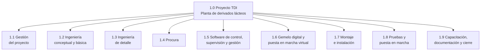

# EDT — Proyecto de Transformación Digital Industrial de la Planta de Derivados Lácteos

> **Alcance:** proyecto de ingeniería, suministro, integración y puesta en marcha de la solución de automatización y Transformación Digital Industrial para las tres líneas de la planta (yogur, queso campesino y kumis) y sus recursos compartidos.

> **Metodología:** EDT de tres niveles según PMBOK (Proyecto → Entregable / cuenta de control → Paquete de trabajo), con la regla del 100 %. Las horas corresponden al equipo de Cremia Automations; el montaje lo ejecutan contratistas bajo su supervisión.

> **Documentos relacionados:** `EDT_Proceso_Yogur.md`, `EDT_Proceso_Queso.md`, `Cronograma_Proyecto.md` y `Propuesta_Empresa_Cremia.md`.

---

## 1. Resumen de la EDT

| Código | Entregable | Paquetes | Horas |
|---|---|---:|---:|
| 1.1 | Gestión del proyecto | 4 | 560 |
| 1.2 | Ingeniería conceptual y básica | 5 | 960 |
| 1.3 | Ingeniería de detalle | 6 | 1.120 |
| 1.4 | Procura | 3 | 400 |
| 1.5 | Software de control, supervisión y gestión | 6 | 1.680 |
| 1.6 | Gemelo digital y puesta en marcha virtual | 3 | 720 |
| 1.7 | Montaje e instalación | 4 | 960 |
| 1.8 | Pruebas y puesta en marcha | 4 | 720 |
| 1.9 | Capacitación, documentación y cierre | 3 | 360 |
| | **Total** | **38** | **7.480** |

Con las tarifas de venta de `Propuesta_Empresa_Cremia.md` (un gerente y cinco líderes de área), las 7.480 horas equivalen a unos COP 550 millones en servicios de ingeniería.

---

## 2. Diagrama de la EDT

---

## 3. Árbol de la EDT

### 1.0 Proyecto de Transformación Digital Industrial de la planta

**1.1 Gestión del proyecto**
- 1.1.1 Plan del proyecto y línea base (alcance, cronograma, presupuesto)
- 1.1.2 Seguimiento y control (reuniones, informes de avance, control de cambios)
- 1.1.3 Gestión de compras y contratos
- 1.1.4 Cierre administrativo

**1.2 Ingeniería conceptual y básica**
- 1.2.1 Levantamiento y caracterización de las tres líneas
- 1.2.2 VSM, simulación y análisis de cuellos de botella
- 1.2.3 Arquitectura ISA-95 y red OT/IT
- 1.2.4 Modelos ISA-88 y recetas
- 1.2.5 P&ID e índice de instrumentos

**1.3 Ingeniería de detalle**
- 1.3.1 Especificación y selección de equipos
- 1.3.2 Diseño eléctrico y de tableros
- 1.3.3 Lista de entradas y salidas y arquitectura de control
- 1.3.4 Diseño de la celda robotizada y análisis de riesgos
- 1.3.5 Diseño de la interfaz HMI (ISA-101)
- 1.3.6 Distribución en planta (layout)

**1.4 Procura**
- 1.4.1 Cotizaciones y selección de proveedores
- 1.4.2 Órdenes de compra y seguimiento de entregas
- 1.4.3 Inspección y pruebas FAT de equipos

**1.5 Software de control, supervisión y gestión**
- 1.5.1 Programa de PLC de la línea de yogur
- 1.5.2 Programa de PLC de la línea de queso
- 1.5.3 Programa de PLC de la línea de kumis
- 1.5.4 Programa de PLC de los recursos compartidos (recepción, pasteurización, CIP)
- 1.5.5 SCADA
- 1.5.6 MES e integración con ERP

**1.6 Gemelo digital y puesta en marcha virtual**
- 1.6.1 Gemelo digital de la línea seleccionada
- 1.6.2 Simulación de la celda robotizada
- 1.6.3 Puesta en marcha virtual (PLC emulado, gemelo digital y SCADA)

**1.7 Montaje e instalación**
- 1.7.1 Supervisión del montaje mecánico
- 1.7.2 Supervisión de la instalación eléctrica y de instrumentación
- 1.7.3 Red industrial y servidores
- 1.7.4 Instalación de la celda robotizada

**1.8 Pruebas y puesta en marcha**
- 1.8.1 Pruebas de lazo y de entradas y salidas
- 1.8.2 Pruebas SAT por línea
- 1.8.3 Arranque con producto y ajuste
- 1.8.4 Validación de calidad e inocuidad (HACCP)

**1.9 Capacitación, documentación y cierre**
- 1.9.1 Capacitación de operadores y de mantenimiento
- 1.9.2 Documentación *as-built* y manuales
- 1.9.3 Acta de entrega y soporte inicial

---

## 4. Diccionario de la EDT

| Código | Paquete de trabajo | Entregable verificable | Responsable (rol) | Horas | Depende de |
|---|---|---|---|---:|---|
| 1.1.1 | Plan del proyecto y línea base | Plan aprobado por el cliente | Gerente de proyecto | 80 | — |
| 1.1.2 | Seguimiento y control | Informes de avance y actas | Gerente de proyecto | 320 | 1.1.1 |
| 1.1.3 | Gestión de compras y contratos | Contratos y órdenes firmadas | Gerente de proyecto | 80 | 1.3.1 |
| 1.1.4 | Cierre administrativo | Acta de cierre y lecciones aprendidas | Gerente de proyecto | 80 | 1.9.3 |
| 1.2.1 | Levantamiento y caracterización | Descripción de proceso, recetas y parámetros por línea | Líder de procesos e instrumentación | 240 | 1.1.1 |
| 1.2.2 | VSM, simulación y cuellos de botella | VSM actual y propuesto, modelo de simulación, indicadores | Líder de gestión de producción | 200 | 1.2.1 |
| 1.2.3 | Arquitectura ISA-95 y red OT/IT | Diagrama de arquitectura y flujos de información | Líder de TDI | 160 | 1.2.1 |
| 1.2.4 | Modelos ISA-88 y recetas | Modelo físico, modelo procedimental y recetas maestras | Líder de TDI | 160 | 1.2.1 |
| 1.2.5 | P&ID e índice de instrumentos | Planos P&ID e índice por línea | Líder de procesos e instrumentación | 200 | 1.2.1 |
| 1.3.1 | Especificación y selección de equipos | Hojas de datos y lista de equipos | Líder de procesos e instrumentación | 200 | 1.2.5 |
| 1.3.2 | Diseño eléctrico y de tableros | Planos eléctricos y de tableros | Líder de control y supervisión | 240 | 1.3.3 |
| 1.3.3 | Lista de E/S y arquitectura de control | Lista de E/S y topología de control | Líder de control y supervisión | 120 | 1.2.5 |
| 1.3.4 | Celda robotizada y análisis de riesgos | Diseño de la celda y matriz de riesgos | Líder de robótica y gemelo digital | 240 | 1.2.1 |
| 1.3.5 | Diseño de la interfaz HMI | Guía de estilo y pantallas según ISA-101 | Líder de control y supervisión | 160 | 1.2.4 |
| 1.3.6 | Distribución en planta | Plano de layout | Líder de gestión de producción | 160 | 1.3.1 |
| 1.4.1 | Cotizaciones y selección de proveedores | Cuadro comparativo y cotizaciones | Gerente de proyecto | 160 | 1.3.1 |
| 1.4.2 | Órdenes de compra y seguimiento | Órdenes emitidas y plan de entregas | Gerente de proyecto | 120 | 1.4.1 |
| 1.4.3 | Pruebas FAT de equipos | Protocolos FAT firmados | Líder de procesos e instrumentación | 120 | 1.4.2 |
| 1.5.1 | PLC de la línea de yogur | Grafcet y programa Ladder probados | Líder de control y supervisión | 280 | 1.3.3, 1.2.4 |
| 1.5.2 | PLC de la línea de queso | Grafcet y programa Ladder probados | Líder de control y supervisión | 280 | 1.3.3, 1.2.4 |
| 1.5.3 | PLC de la línea de kumis | Grafcet y programa Ladder probados | Líder de control y supervisión | 280 | 1.3.3, 1.2.4 |
| 1.5.4 | PLC de los recursos compartidos | Programa de recepción, pasteurización y CIP | Líder de control y supervisión | 200 | 1.3.3 |
| 1.5.5 | SCADA | Aplicación con alarmas, tendencias y estado de lotes | Líder de control y supervisión | 320 | 1.3.5 |
| 1.5.6 | MES e integración con ERP | Órdenes, recetas, trazabilidad e indicadores integrados | Líder de TDI | 320 | 1.2.3, 1.2.4 |
| 1.6.1 | Gemelo digital | Modelo con sensores y actuadores virtuales | Líder de robótica y gemelo digital | 320 | 1.3.6 |
| 1.6.2 | Simulación de la celda robotizada | Estación simulada y programa del robot | Líder de robótica y gemelo digital | 200 | 1.3.4 |
| 1.6.3 | Puesta en marcha virtual | Informe de validación con lotes y recetas | Líder de robótica y gemelo digital | 200 | 1.5.1–1.5.5, 1.6.1 |
| 1.7.1 | Supervisión del montaje mecánico | Equipos instalados y alineados | Líder de procesos e instrumentación | 320 | 1.4.3 |
| 1.7.2 | Instalación eléctrica y de instrumentación | Tableros e instrumentos conectados | Líder de control y supervisión | 320 | 1.3.2, 1.4.3 |
| 1.7.3 | Red industrial y servidores | Red y servidores en servicio | Líder de TDI | 160 | 1.2.3 |
| 1.7.4 | Instalación de la celda robotizada | Celda instalada con sus seguridades | Líder de robótica y gemelo digital | 160 | 1.6.2 |
| 1.8.1 | Pruebas de lazo y de E/S | Protocolos de lazo firmados | Líder de control y supervisión | 160 | 1.7.2 |
| 1.8.2 | Pruebas SAT por línea | Protocolos SAT firmados | Gerente de proyecto | 240 | 1.8.1, 1.6.3 |
| 1.8.3 | Arranque con producto y ajuste | Lotes de prueba conformes en las tres líneas | Líder de procesos e instrumentación | 200 | 1.8.2 |
| 1.8.4 | Validación de calidad e inocuidad | Registros de PCC y liberación de lotes | Líder de gestión de producción | 120 | 1.8.3 |
| 1.9.1 | Capacitación | Personal capacitado y evaluado | Líder de gestión de producción | 120 | 1.8.2 |
| 1.9.2 | Documentación *as-built* y manuales | Planos finales y manuales entregados | Líder de TDI | 160 | 1.8.3 |
| 1.9.3 | Acta de entrega y soporte inicial | Acta firmada por el cliente | Gerente de proyecto | 80 | 1.8.4, 1.9.1, 1.9.2 |

---

## 5. Referencias

- Project Management Institute, *PMBOK Guide* (EDT/WBS, cuenta de control y paquete de trabajo).
- Especificaciones del Proyecto Integrador APM 2026-2S.
