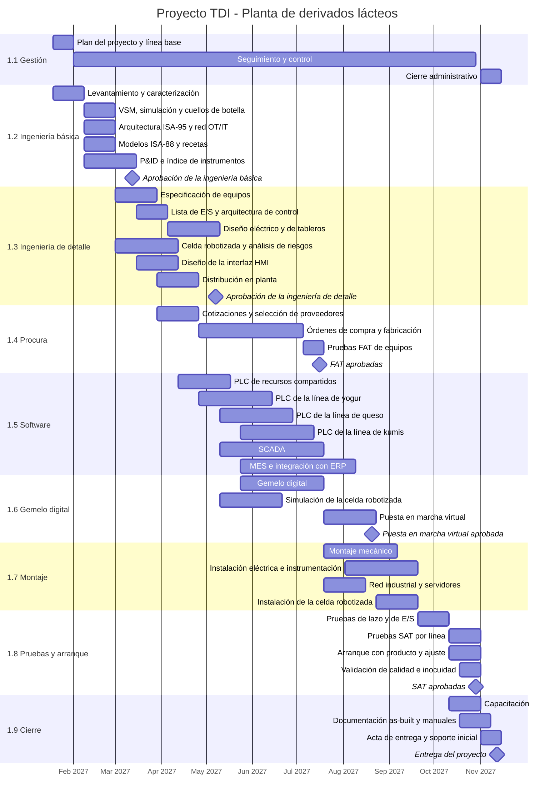

# Cronograma — Proyecto de Transformación Digital Industrial de la Planta de Derivados Lácteos

> **Alcance:** cronograma de ejecución del proyecto de automatización de las tres líneas de la planta (yogur, queso campesino y kumis), construido a partir de la `EDT_Proyecto.md`.

> **Supuestos:** inicio el 18 de enero de 2027, después de la aceptación de la oferta. La planta sigue en producción durante el proyecto; el montaje se hace por línea, en paradas programadas.

> **Duración estimada:** 43 semanas (10 meses), del 18 de enero al 12 de noviembre de 2027.

---

## 1. Diagrama de Gantt

---

## 2. Hitos

| Hito | Fecha | Pago asociado |
|---|---|---:|
| Inicio del proyecto (firma del contrato) | 18 de enero de 2027 | 30 % |
| Aprobación de la ingeniería básica | 12 de marzo de 2027 | — |
| Aprobación de la ingeniería de detalle | 7 de mayo de 2027 | — |
| Pruebas FAT aprobadas | 16 de julio de 2027 | 30 % |
| Puesta en marcha virtual aprobada | 20 de agosto de 2027 | — |
| Pruebas SAT aprobadas | 29 de octubre de 2027 | 30 % |
| Entrega del proyecto | 12 de noviembre de 2027 | 10 % |

---

## 3. Ruta crítica

`Levantamiento → P&ID → Especificación de equipos → Cotizaciones → Fabricación de equipos → FAT → Montaje → Pruebas de lazo → SAT → Entrega`

El plazo lo determina la fabricación y entrega de los equipos (10 semanas). La programación de PLC, el SCADA y el gemelo digital avanzan en paralelo con la procura, y la puesta en marcha virtual permite llegar al montaje con el software ya probado.

---

## 4. Carga de trabajo por fase

| Fase | Semanas | Horas (EDT) |
|---|---:|---:|
| 1.1 Gestión | 43 | 560 |
| 1.2 Ingeniería conceptual y básica | 8 | 960 |
| 1.3 Ingeniería de detalle | 10 | 1.120 |
| 1.4 Procura | 16 | 400 |
| 1.5 Software | 17 | 1.680 |
| 1.6 Gemelo digital y puesta en marcha virtual | 15 | 720 |
| 1.7 Montaje e instalación | 9 | 960 |
| 1.8 Pruebas y puesta en marcha | 6 | 720 |
| 1.9 Capacitación, documentación y cierre | 5 | 360 |
| **Total** | **43** | **7.480** |

La capacidad del equipo es de 6 personas × 43 semanas × 42 h = 10.836 h, de modo que la ocupación media es del 69 %.
