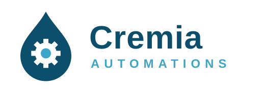

# Logo de Cremia Automations — Propuesta

> **Alcance:** propuesta de identidad visual de la empresa integradora: isotipo, logotipo y colores.

---

## 1. Versiones

| Versión | Archivo | Uso |
|---|---|---|
| Horizontal sobre fondo claro | `logo_horizontal.svg` | Página web, documentos e informes |
| Horizontal sobre fondo oscuro | `logo_horizontal_oscuro.svg` | Encabezados, presentaciones y video |
| Isotipo | `isotipo.svg` | Ícono de la página, cajetines de planos y HMI |

---

## 2. Concepto

- **Gota:** la leche, materia prima común a las tres líneas de la planta.
- **Engranaje:** la automatización del proceso.
- **Punto central:** el dato, que conecta el proceso con la gestión de la producción (OT e IT).
- **Nombre:** *Cremia* viene de crema, el producto lácteo; *Automations* indica la actividad de la empresa.

## 3. Colores y tipografía

| Elemento | Valor |
|---|---|
| Azul principal | `#0b4f6c` |
| Celeste de acento | `#3aa6c9` |
| Crema | `#f6f1e3` |
| Tipografía | Segoe UI (o Arial como respaldo), peso 700 para el nombre y 600 para el descriptor |

Los archivos se regeneran con `node generar_logo.js`.
